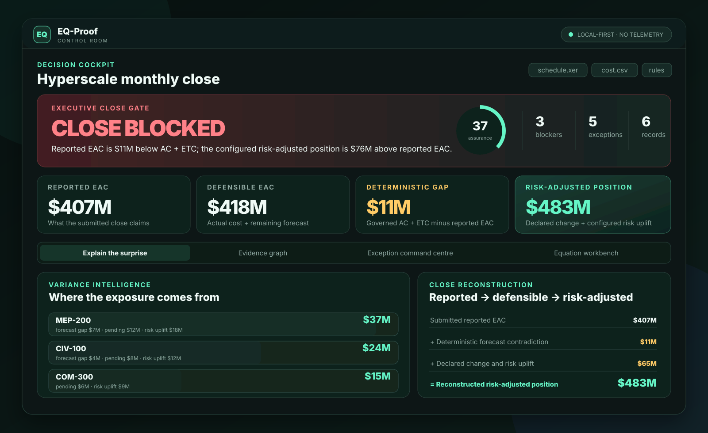
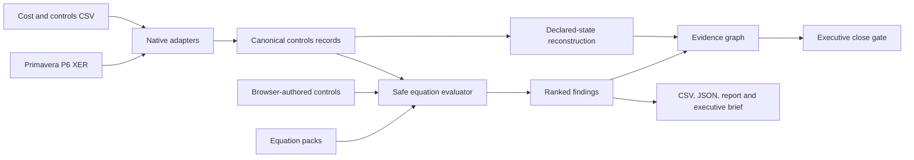

# EQ-Proof Control Room

**A local-first project-controls assurance system that compiles Primavera P6, cost, change, risk and user-written equations into a traceable monthly-close gate.**

Project controls are usually reviewed in fragments: schedule quality in P6, cost and earned value in spreadsheets or enterprise exports, change in a register, risk in another workbook, and the executive forecast in a deck.

Every number can look plausible while the combined close is internally impossible. EQ-Proof reconstructs the declared position, executes the acceptance logic, identifies the records that fail, and preserves the route from source record to close decision.

<p align="center">
  <a href="https://florianstuettgen.github.io/EQ-Proof/"><strong>Open the functional browser workbench</strong></a>
  ·
  <a href="docs/SHOWCASE.md">Portfolio case study</a>
  ·
  <a href="docs/SEMANTIC_MODEL.md">Semantic model</a>
  ·
  <a href="docs/RUNTIME_MODES.md">Runtime and privacy</a>
</p>

<p align="center">
  <a href="https://github.com/FlorianStuettgen/EQ-Proof/actions/workflows/ci.yml"></a>
  <a href="https://github.com/FlorianStuettgen/EQ-Proof/actions/workflows/ui-audit.yml"></a>
  <a href="https://github.com/FlorianStuettgen/EQ-Proof/actions/workflows/codeql.yml"></a>
  
</p>

<p align="center">
  
</p>

## Use the hosted application

Open the [functional browser workbench](https://florianstuettgen.github.io/EQ-Proof/).

The hosted application can:

- parse one or more generic project-controls CSV exports;
- parse Primavera P6 XER `TASK` records;
- load optional JSON equation packs;
- validate and execute browser-authored controls;
- calculate SHA-256 source manifests with Web Crypto;
- reconstruct the close gate, account contributions, findings and evidence graph;
- operate session-only by default;
- optionally remember the complete workspace in browser storage after explicit opt-in;
- export and reopen the complete `eq-proof/control-room@2` JSON artifact;
- export the exception register and executive brief; and
- reset to the deterministic demo or clear saved browser data at any time.

Files are processed entirely in the browser. They are never uploaded to EQ-Proof, a third-party API, analytics service or model endpoint.

The complete workspace may include normalized records, source names and hashes, equations, findings and reconstructed values. **Remember workspace on this browser** is therefore disabled by default. Enable it only on an appropriate device and browser profile; otherwise the completed analysis remains available for the current tab and should be exported before the page is closed or reloaded.

Downloadable CSV, XER and equation-pack samples are available directly inside the analysis dialog.

The **Take the guided Control Room tour** action remains available for a structured walkthrough of either the deterministic sample or a close compiled from your own files.

See [Runtime Modes and Data Handling](docs/RUNTIME_MODES.md) for the canonical hosted-browser, loopback and CLI boundaries.

## What the checked-in scenario proves

The synthetic hyperscale scenario deliberately produces separate conclusions:

| State | Value | Meaning |
| --- | ---: | --- |
| Reported EAC | **$407M** | submitted deterministic forecast |
| Detail-reconstructed EAC | **$418M** | arithmetic reconstruction from `AC + ETC` |
| Deterministic forecast gap | **$11M** | submitted EAC contradicts its available detail |
| Declared change and configured risk | **$65M** | pending change plus supplied risk uplift |
| Reconstructed risk-adjusted position | **$483M** | declared bridge built from detail-reconstructed EAC |
| Submitted risk-adjusted summary | **$472M** | summary supplied by the close |
| Risk-adjusted reconciliation gap | **$11M** | submitted summary is below the declared bridge |
| Position above reported EAC | **$76M** | deterministic contradiction plus declared exposure |

The current schema retains `defensible_eac` as a compatibility field. The visitor-facing label is **detail-reconstructed EAC** because `AC + ETC` proves an arithmetic relationship, not independent commercial defensibility.

The `$76M` is not treated as one homogeneous error. It consists of `$11M` of direct deterministic contradiction and `$65M` of declared pending-change and configured-risk exposure.

EQ-Proof does not call all `$76M` hidden, and it does not claim that deterministic addition calculates a statistical P80.

## Why this is more than a dashboard

### It evaluates the close

The gate is derived from selected and applicable equations. It is not manually assigned.

| Gate | Meaning |
| --- | --- |
| `CLOSE BLOCKED` | at least one blocker control failed |
| `REVIEW REQUIRED` | no blocker failed, but a lower-severity control failed |
| `CLOSE READY` | no selected, applicable control failed |

`CLOSE READY` means internally consistent under the executed controls. It is not contractual certification.

### It preserves the route to the answer

```text
source record
    → failed equation
        → affected metric or assurance domain
            → executive close gate
```

A schedule-quality finding affects schedule assurance rather than receiving a fabricated dollar impact. Monetary relationships exist only where supplied fields and equations support them.

### It produces reusable evidence

The browser workbench and Python engine produce the same decision vocabulary:

- source record and SHA-256 manifest;
- complete equation manifest;
- status, severity and residual;
- declared impact domain;
- required remediation;
- portfolio reconstruction;
- bounded evidence graph; and
- schema-versioned Control Room JSON.

Outputs are suitable for Excel, Power Query, Power BI, Smartsheet, SharePoint, ticket automation and auditable close packages.

## Product surfaces

EQ-Proof has a deliberate hierarchy:

1. **Control Room** is the primary monthly-close assurance product.
2. **`eq-controls`** is the project-controls engine and automation surface behind the browser and CLI workflows.
3. **`eq-proof`** is the lower numerical repair, attestation and semantic-replay engine. It is independently versioned and optional for ordinary close-gate use.

The lower proof engine strengthens reproducibility for numerical workflows, but it is not the product definition of the Control Room.

## Browser engine boundary

The hosted workbench uses a purpose-built expression parser. It does not use JavaScript `eval`, `Function`, imported code or remote execution.

The supported equation language permits:

- finite numeric constants;
- declared identifiers;
- `+`, `-`, `*` and `/`;
- exactly one of `==`, `<=`, `>=`, `<` or `>`; and
- `abs`, `min`, `max` and `round`.

It rejects executable statements, attributes, assignments, unsupported operators, duplicate equation IDs, undeclared fields and oversized inputs.

For automated pipelines, very large exports, server-side controls or machine-usable exit codes, use the Python CLI or loopback application.

## Run the local Python application

```bash
python -m venv .venv
. .venv/bin/activate                    # Windows: .venv\Scripts\activate
python -m pip install -e '.[web]'
eq-controls serve
```

Open `http://127.0.0.1:8765` when the browser does not open automatically.

The loopback application processes uploads in a request-scoped operating-system temporary directory and does not persist them. Files explicitly downloaded by the user remain wherever the user saves them.

## Run the CLI close gate

```bash
eq-controls analyze \
  --p6-xer examples/hyperscale_close/schedule.xer \
  --cost-csv examples/hyperscale_close/cost.csv \
  --equations examples/hyperscale_close/custom_equations.json \
  --currency USD \
  --fail-on blocker \
  --output outputs/hyperscale-close
```

Outputs:

- `analysis.json` — source hashes, complete equation manifest and every result;
- `control-room.json` — schema-versioned reconstruction and evidence graph;
- `exceptions.csv` — spreadsheet-safe action register; and
- `report.md` — human-readable close record.

Exit codes:

- `0` — no failures at or above the selected threshold;
- `2` — input or execution error; and
- `3` — selected failure threshold reached.

## Native integration boundary

The demonstrated adapters are explicit:

- **Primavera P6:** native XER parsing of `TASK` records;
- **cost and controls systems:** deterministic CSV aliases suitable for exported tables; and
- **not yet included:** live EcoSys, SAP, Oracle, Cobra or P6 database connectors.

Recognized aliases include:

```text
BAC / budget_at_completion
AC / actual_cost / actuals
ETC / estimate_to_complete
EAC / forecast_at_completion
PV / BCWS
EV / BCWP
baseline_budget / original_budget
approved_changes
pending_change_exposure
risk_exposure / configured_risk_uplift
risk_adjusted_EAC / P80_EAC
```

`P80_EAC` is accepted as a compatibility alias for a submitted risk-adjusted summary. EQ-Proof validates its declared arithmetic bridge; it does not certify the probability methodology that produced it.

Field mapping is deterministic, inspectable and non-AI.

## Tested catalogue

| Domain | Representative control |
| --- | --- |
| Cost | `EAC == AC + ETC` |
| Forecast | `VAC == BAC - EAC` |
| Earned value | `CV == EV - AC` and `SV == EV - PV` |
| Performance indices | `CPI == EV / AC` and `SPI == EV / PV` |
| Change governance | `current_budget == baseline_budget + approved_changes` |
| Risk bridge | `risk_adjusted_EAC == EAC + pending_change_exposure + risk_exposure` |
| P6 status integrity | active activity retains positive remaining duration |
| P6 float review | extreme negative float starter threshold |

Project-specific controls use the same safe evaluator:

```json
{
  "id": "portfolio.board_authorization",
  "title": "EAC remains inside delegated authorization",
  "domain": "governance",
  "expression": "EAC <= delegated_authorization",
  "severity": "blocker",
  "description": "Forecasts beyond delegated authority require escalation.",
  "remediation": "Supply approved authority or escalate the forecast.",
  "required_fields": ["EAC", "delegated_authorization"],
  "record_type": "control_account"
}
```

## Precise reconstruction model

```text
reported EAC                         = submitted EAC
detail-reconstructed EAC             = AC + ETC
deterministic forecast gap           = detail-reconstructed EAC - reported EAC
configured change and risk           = pending change + configured risk uplift
reconstructed risk-adjusted EAC      = detail-reconstructed EAC + configured change and risk
risk-adjusted reconciliation         = reconstructed risk-adjusted EAC - submitted risk-adjusted EAC
position above reported EAC          = reconstructed risk-adjusted EAC - reported EAC
```

Reported values are never silently overwritten. Incomplete submitted risk-adjusted coverage remains explicitly incomplete rather than being summed into a misleading partial total.

See the [Semantic Model](docs/SEMANTIC_MODEL.md) for authoritative vocabulary and compatibility boundaries.

## Architecture



The hosted application uses semantic HTML, CSS and vanilla JavaScript. The Python implementation powers the CLI and local API. A shared golden-fixture test runs the checked-in P6, cost and equation files through the browser engine and compares the resulting gate, reconstruction, findings, source manifest and graph with the Python-generated public Control Room artifact.

## Engineering evidence

Repository proof enforces:

- Python **3.10–3.13**;
- branch-aware coverage above a **92% gate**;
- browser-engine unit tests;
- Python-generated-demo versus browser-engine semantic equivalence;
- real file-to-decision Playwright workflows;
- desktop, mobile and reduced-motion coverage;
- keyboard, focus, download and explicit-persistence tests;
- axe accessibility checks;
- adversarial equation tests;
- P6 XER and CSV adapter tests;
- deterministic regeneration of both evidence families;
- JavaScript syntax validation;
- wheel construction;
- CodeQL; and
- signed proof and semantic-replay scenarios.

The exact test count remains in validated pull-request records rather than being hard-coded into the public product, preventing stale engineering claims.

Performance claims are bounded: the [checked-in numerical baseline](benchmarks/README.md) is a **proof-engine microbenchmark** for representative dense numerical-repair cases up to 250 variables. It is not a Control Room, P6-ingestion or project-controls throughput result and is not a service-level objective.

Run the repository proof locally:

```bash
python scripts/check_repository.py
npm ci
npm run test:browser-engine
npm run test:ui
```

## Current fit

EQ-Proof is currently a good fit for controlled evaluation, portfolio demonstration, local close reconciliation, governed equation packs and automation over supported P6 `TASK` and CSV exports.

It is not yet a replacement for a production cost system, scheduling engine, risk simulator, enterprise integration platform, key-management service or contractual certification process. Cross-period movement intelligence, deeper P6 network analysis, WBS aggregation and additional enterprise adapter profiles remain roadmap work.

## Status and roadmap

EQ-Proof is a **Beta portfolio and engineering product**.

The next product cycle is cross-period forecast intelligence: comparing prior and current closes, identifying supported movement, lifecycle changes, governance changes and unreconciled restatements.

## License

Apache-2.0 © 2026 Florian Stuettgen.
