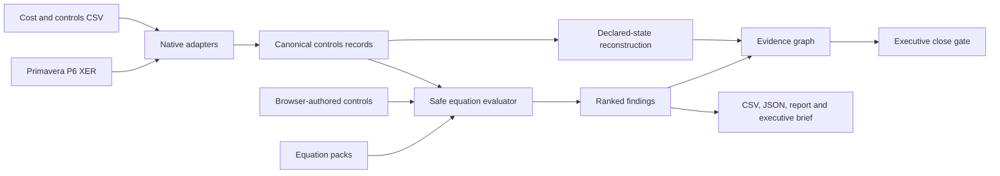

<p align="center">
  
</p>

<p align="center">
  <a href="https://florianstuettgen.github.io/EQ-Proof/"><strong>Take the guided Control Room tour</strong></a>
  ·
  <a href="docs/SHOWCASE.md">Portfolio case study</a>
  ·
  <a href="docs/SEMANTIC_MODEL.md">Semantic model</a>
  ·
  <a href="docs/PRODUCT_ARCHITECTURE.md">Architecture</a>
</p>

<p align="center">
  <a href="https://github.com/FlorianStuettgen/EQ-Proof/actions/workflows/ci.yml"></a>
  <a href="https://github.com/FlorianStuettgen/EQ-Proof/actions/workflows/codeql.yml"></a>
  
  
  
  
</p>

# EQ-Proof Control Room

**A local-first project-controls assurance system that compiles Primavera P6, cost, change, risk and user-written equations into a traceable monthly-close gate.**

Project controls are usually reviewed in fragments: schedule quality in P6, cost and earned value in spreadsheets or enterprise exports, change in a register, risk in another workbook, and the executive forecast in a deck.

Every number can look plausible while the combined close is internally impossible.

EQ-Proof reconstructs the declared position, executes the acceptance logic, identifies the records that fail, and preserves the evidence behind the decision.

## See the product in 90 seconds

Open the [hosted synthetic showcase](https://florianstuettgen.github.io/EQ-Proof/) and choose **Take the 90-second tour**.

The tour walks through one complete decision:

1. **Gate:** why the close is blocked;
2. **Contradiction:** why reported EAC is `$11M` below governed `AC + ETC`;
3. **Material account:** which control account creates the largest movement;
4. **Lineage:** how the source record reaches the executive decision; and
5. **Action:** what must be corrected before close acceptance.

The browser can then export a Markdown executive brief containing the decision, reconstructed states, ranked actions and source hashes.

## The synthetic result

The checked-in hyperscale scenario produces deliberately separate conclusions:

| State | Value | Meaning |
| --- | ---: | --- |
| Reported EAC | **$407M** | submitted deterministic forecast |
| Defensible EAC | **$418M** | independently reconstructed `AC + ETC` |
| Deterministic forecast gap | **$11M** | submitted EAC contradicts its governed detail |
| Declared change and configured risk | **$65M** | pending change plus supplied risk uplift |
| Reconstructed risk-adjusted position | **$483M** | declared bridge built from defensible EAC |
| Submitted risk-adjusted summary | **$472M** | summary supplied by the close |
| Risk-adjusted reconciliation gap | **$11M** | submitted summary is below the declared bridge |
| Position above reported EAC | **$76M** | deterministic contradiction plus declared exposure |

The `$76M` is not treated as one homogeneous error.

It consists of:

- `$11M` of direct deterministic forecast contradiction; and
- `$65M` of declared pending-change and configured-risk exposure.

EQ-Proof does not call all `$76M` hidden, and it does not claim that deterministic addition calculates a statistical P80.

## Why this is more than a dashboard

### It evaluates the close

The gate is derived from selected and applicable equations. It is not manually assigned.

| Gate | Meaning |
| --- | --- |
| `CLOSE BLOCKED` | at least one blocker control failed |
| `REVIEW REQUIRED` | no blocker failed, but a lower-severity control failed |
| `CLOSE READY` | no selected, applicable control failed |

`CLOSE READY` means internally consistent under the executed controls. It is not contractual certification.

### It preserves the route to the answer

The evidence graph follows declared lineage:

```text
source record
    → failed equation
        → affected metric or assurance domain
            → executive close gate
```

A schedule-quality finding affects schedule assurance rather than receiving a fabricated dollar impact. Monetary relationships exist only where the supplied fields and equations support them.

### It produces work, not just insight

The exception command centre retains:

- source record;
- equation ID and expression;
- residual;
- declared impact domain;
- severity and materiality; and
- required remediation.

Outputs are suitable for Excel, Power Query, Power BI, Smartsheet, SharePoint, ticket automation and auditable close packages.

## Run it

### Public synthetic showcase

```text
https://florianstuettgen.github.io/EQ-Proof/
```

The static site has no private-file upload endpoint.

### Local real-file Control Room

```bash
python -m venv .venv
. .venv/bin/activate                    # Windows: .venv\Scripts\activate
python -m pip install -e '.[web]'
eq-controls serve
```

Open `http://127.0.0.1:8765` if the browser does not open automatically.

The local application accepts:

- one or more Primavera P6 XER exports;
- one or more generic cost/control-account CSV exports;
- optional JSON equation packs;
- equations authored and server-validated in the browser; and
- an explicit three-letter currency label.

Uploads are processed in a request-scoped operating-system temporary directory and are not persisted by EQ-Proof.

### CLI close gate

```bash
eq-controls analyze \
  --p6-xer examples/hyperscale_close/schedule.xer \
  --cost-csv examples/hyperscale_close/cost.csv \
  --equations examples/hyperscale_close/custom_equations.json \
  --currency USD \
  --fail-on blocker \
  --output outputs/hyperscale-close
```

Outputs:

- `analysis.json` — source hashes, complete equation manifest and every result;
- `control-room.json` — schema-versioned reconstruction and bounded evidence graph;
- `exceptions.csv` — spreadsheet-safe action register; and
- `report.md` — human-readable close record.

Exit codes:

- `0` — no failures at or above the selected threshold;
- `2` — input or execution error; and
- `3` — selected failure threshold reached.

## Native integration boundary

The current demonstrated boundary is explicit:

- **Primavera P6:** native XER parsing of `TASK` records;
- **cost and controls systems:** deterministic CSV field aliases suitable for exported tables; and
- **not yet included:** live EcoSys, SAP, Oracle, Cobra or P6 database connectors.

Recognized aliases include:

```text
BAC / budget_at_completion
AC / actual_cost / actuals
ETC / estimate_to_complete
EAC / forecast_at_completion
PV / BCWS
EV / BCWP
baseline_budget / original_budget
approved_changes
pending_change_exposure
risk_exposure / configured_risk_uplift
risk_adjusted_EAC / P80_EAC
```

`P80_EAC` is accepted as a compatibility alias for a submitted risk-adjusted summary. EQ-Proof validates its declared arithmetic bridge; it does not certify the probability methodology that produced it.

Field mapping is deterministic, inspectable and non-AI.

## Tested catalogue plus user-written controls

The built-in catalogue spans:

| Domain | Representative control |
| --- | --- |
| Cost | `EAC == AC + ETC` |
| Forecast | `VAC == BAC - EAC` |
| Earned value | `CV == EV - AC` and `SV == EV - PV` |
| Performance indices | `CPI == EV / AC` and `SPI == EV / PV` |
| Change governance | `current_budget == baseline_budget + approved_changes` |
| Risk bridge | `risk_adjusted_EAC == EAC + pending_change_exposure + risk_exposure` |
| P6 status integrity | active activity retains positive remaining duration |
| P6 float review | extreme negative float starter threshold |

Project- and client-specific controls use the same engine:

```json
{
  "id": "portfolio.board_authorization",
  "title": "EAC remains inside delegated authorization",
  "domain": "governance",
  "expression": "EAC <= delegated_authorization",
  "severity": "blocker",
  "description": "Forecasts beyond delegated authority require escalation.",
  "remediation": "Supply approved authority or escalate the forecast.",
  "required_fields": ["EAC", "delegated_authorization"],
  "record_type": "control_account"
}
```

The evaluator permits finite numeric constants, declared fields, arithmetic, one comparison, and a small function allow-list. It rejects imports, attributes, assignments, executable statements, duplicate IDs, undeclared fields, unsupported operators and oversized inputs.

Optional `applies_when` metadata lets an equation declare when it applies without hard-coding project-specific behavior into the engine.

## Precise reconstruction model

```text
reported EAC                    = submitted EAC
defensible EAC                  = AC + ETC
deterministic forecast gap      = defensible EAC - reported EAC
configured change and risk      = pending change + configured risk uplift
reconstructed risk-adjusted EAC = defensible EAC + configured change and risk
risk-adjusted reconciliation    = reconstructed risk-adjusted EAC - submitted risk-adjusted EAC
position above reported EAC     = reconstructed risk-adjusted EAC - reported EAC
```

Reported values are never silently overwritten. Incomplete submitted risk-adjusted coverage remains explicitly incomplete rather than being summed into a misleading partial portfolio total.

See the [Semantic Model](docs/SEMANTIC_MODEL.md) for the authoritative vocabulary and boundaries.

## Architecture



The browser is build-free: semantic HTML, CSS and vanilla JavaScript served by the local Python application or GitHub Pages. The same Python engine powers the CLI and local API; static mode uses a deterministically generated synthetic payload.

## Security and resource boundaries

Local mode enforces:

- loopback-only hosts and trusted-host validation;
- restrictive Content Security Policy and browser hardening headers;
- no external JavaScript, fonts, analytics, CDN or model call;
- 50 MiB per-file, 200 MiB per-request and 20-file limits;
- equation-count, expression-size, AST-node and adapter-row limits;
- basename normalization and unique temporary filenames;
- request-scoped temporary directories and no upload persistence;
- escaped user-authored labels;
- spreadsheet-formula neutralization in CSV exports; and
- JSON-safe representation of non-finite arithmetic failures.

EQ-Proof does not establish contractual truth, approve changes, replace P6 calculations, perform currency conversion, calculate probabilistic risk or infer missing commercial facts.

## Independently versioned lower proof engine

The repository also contains the original numerical proof engine for supported linear-convex repairs:

- safe linear specification compiler;
- Dykstra Euclidean projection;
- fixed-value preservation;
- canonical JSON and SHA-256;
- optional Ed25519 attestation; and
- semantic replay that independently recompiles and recomputes claimed repairs.

That engine remains available through `eq-proof`.

## Engineering evidence

The repository proof enforces the complete automated suite across:

- Python **3.10–3.13**;
- branch-aware coverage above a **92% gate**;
- adversarial and valid user-equation tests;
- P6 XER and CSV adapter tests;
- multipart upload and loopback-security tests;
- non-finite and spreadsheet-export hardening;
- deterministic regeneration of both evidence families;
- JavaScript syntax validation;
- wheel construction;
- signed proof and semantic-replay scenarios; and
- the operational P6 + cost + user-equation close scenario.

The exact test count is retained in the validated pull-request record instead of being hard-coded into the public product, preventing the showcase from becoming stale whenever coverage expands.

Run the same proof locally:

```bash
python scripts/check_repository.py
```

## Status and roadmap

EQ-Proof is a **Beta portfolio and engineering product**, not a production cost system, scheduling engine, risk simulator, key-management service or contractual certification platform.

The highest-value next capabilities are:

1. cross-period snapshot comparison and restatement detection;
2. Primavera relationships, calendars, constraints and open-end analysis;
3. WBS and control-account aggregation scopes;
4. forecast movement bridges with explicit causal drivers; and
5. dedicated adapter profiles for additional enterprise exports.

## License

Apache-2.0 © 2026 Florian Stuettgen.
