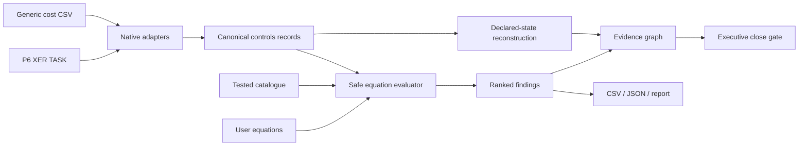

<p align="center">
  
</p>

<p align="center">
  <a href="https://florianstuettgen.github.io/EQ-Proof/"><strong>Open the synthetic Control Room demo</strong></a>
  ·
  <a href="docs/DEMO_PLAYBOOK.md">Five-minute walkthrough</a>
  ·
  <a href="docs/SEMANTIC_MODEL.md">Semantic model</a>
  ·
  <a href="docs/PRODUCT_ARCHITECTURE.md">Architecture</a>
</p>

<p align="center">
  <a href="https://github.com/FlorianStuettgen/EQ-Proof/actions/workflows/ci.yml"></a>
  <a href="https://github.com/FlorianStuettgen/EQ-Proof/actions/workflows/codeql.yml"></a>
  
  
  
  
</p>

# EQ-Proof Control Room

**Drop in the files behind the monthly close. EQ-Proof reconstructs the deterministic forecast, reconciles the submitted risk-adjusted summary, and traces every material exception to its source equation.**

Project controls are usually reviewed in fragments: schedule quality in P6, cost and earned value in spreadsheets or enterprise exports, change in a register, risk in another workbook, and the executive position in a deck. Each value can look plausible while the combined close is internally impossible.

EQ-Proof turns the declared relationships among those files into executable controls.

## What you know in 20 seconds

The checked-in synthetic hyperscale close produces four deliberately separate conclusions:

| State | Value | What it means |
| --- | ---: | --- |
| Reported EAC | **$407M** | submitted deterministic forecast |
| Defensible EAC | **$418M** | governed `AC + ETC` reconstruction |
| Deterministic forecast gap | **$11M** | internal contradiction between EAC and its detail |
| Reconstructed risk-adjusted position | **$483M** | defensible EAC plus declared pending change and configured risk uplift |
| Submitted risk-adjusted summary | **$472M** | risk-adjusted total supplied by the close |
| Risk-adjusted reconciliation gap | **$11M** | submitted summary below the declared bridge |
| Exposure above reported EAC | **$76M** | reconstructed risk-adjusted position above deterministic reported EAC |

The `$76M` is not one homogeneous error. It consists of:

- `$11M` of deterministic forecast contradiction; and
- `$65M` of declared pending-change and configured-risk exposure.

EQ-Proof keeps those components separate. It does not call all `$76M` hidden, and it does not claim that adding deterministic exposure calculates a statistical P80.

The close is blocked by three blocker-level control failures, including EAC summaries that disagree with `AC + ETC` and current-budget movement without an approved bridge.

This is executable evidence, not a hand-authored dashboard. `scripts/regenerate_control_room_demo.py` rebuilds the browser payload from the checked-in P6 XER, cost CSV, user equation pack, catalogue and production analysis code.

## Product modes

### Public synthetic demo

The [hosted Control Room](https://florianstuettgen.github.io/EQ-Proof/) provides:

- executive close gate;
- deterministic and risk-adjusted reconciliation;
- account-by-account exposure decomposition;
- navigable source → equation → declared-impact lineage;
- filtered exception command centre;
- tested equation catalogue;
- browser equation-pack authoring.

The hosted static application cannot accept private files.

### Local real-file application

```bash
python -m venv .venv
. .venv/bin/activate                    # Windows: .venv\Scripts\activate
python -m pip install -e '.[web]'
eq-controls serve
```

Open `http://127.0.0.1:8765` if the browser does not open automatically.

The local application accepts:

- one or more Primavera P6 XER exports;
- one or more generic cost/control-account CSV exports;
- optional JSON equation packs;
- equations authored and server-validated in the browser;
- an explicit three-letter currency label.

Uploads are processed in a request-scoped operating-system temporary directory and are not persisted by EQ-Proof. The application has no telemetry, model call, CDN, external script or database connection.

## Native integration boundary

The current integration boundary is explicit:

- **Primavera P6:** native XER parsing of `TASK` records;
- **cost and controls systems:** deterministic CSV field aliases, suitable for exported tables from analyst workbooks and enterprise tools;
- **not yet included:** live EcoSys, SAP, Oracle, Cobra or P6 database connectors.

Recognized aliases include:

```text
BAC / budget_at_completion
AC / actual_cost / actuals
ETC / estimate_to_complete
EAC / forecast_at_completion
PV / BCWS
EV / BCWP
baseline_budget / original_budget
approved_changes
pending_change_exposure
risk_exposure / configured_risk_uplift
risk_adjusted_EAC / P80_EAC
```

`P80_EAC` is accepted as a compatibility alias for a submitted risk-adjusted summary. EQ-Proof validates its declared arithmetic bridge; it does not certify that the source value was produced by a probabilistic P80 methodology.

Field mapping is deterministic, inspectable and non-AI.

## Tested equations plus user-written controls

The built-in catalogue spans:

| Domain | Representative control |
| --- | --- |
| Cost | `EAC == AC + ETC` |
| Forecast | `VAC == BAC - EAC` |
| Earned value | `CV == EV - AC` and `SV == EV - PV` |
| Performance indices | `CPI == EV / AC` and `SPI == EV / PV` |
| Change governance | `current_budget == baseline_budget + approved_changes` |
| Risk bridge | `risk_adjusted_EAC == EAC + pending_change_exposure + risk_exposure` |
| P6 status integrity | active activity retains positive remaining duration |
| P6 float review | extreme negative float starter threshold |

Project- and client-specific controls use the same engine:

```json
[
  {
    "id": "portfolio.board_authorization",
    "title": "EAC remains inside delegated authorization",
    "domain": "governance",
    "expression": "EAC <= delegated_authorization",
    "severity": "blocker",
    "description": "Forecasts beyond delegated authority require escalation.",
    "remediation": "Supply approved authority or escalate the forecast.",
    "required_fields": ["EAC", "delegated_authorization"],
    "record_type": "control_account"
  }
]
```

The evaluator permits finite numeric constants, declared fields, arithmetic, one comparison, and a small function allow-list. It rejects imports, attributes, assignment, executable statements, duplicate IDs, undeclared expression fields, unsupported operators, oversized packs, oversized expressions and oversized syntax trees.

Optional `applies_when` metadata lets a control declare when it applies without hard-coding domain exceptions in the engine.

## A precise reconstruction model

```text
reported EAC                    = submitted EAC
defensible EAC                  = AC + ETC
deterministic forecast gap      = defensible EAC - reported EAC
configured change and risk      = pending change + configured risk uplift
reconstructed risk-adjusted EAC = defensible EAC + configured change and risk
risk-adjusted reconciliation    = reconstructed risk-adjusted EAC - submitted risk-adjusted EAC
exposure above reported EAC     = reconstructed risk-adjusted EAC - reported EAC
```

Reported values are never silently overwritten. Incomplete submitted risk-adjusted coverage remains explicitly incomplete rather than being summed into a misleading partial portfolio total.

See the [Semantic Model](docs/SEMANTIC_MODEL.md) for the authoritative vocabulary and interpretation boundaries.

## Evidence graph without invented causality

The graph connects:

```text
source record → violated equation → declared metric or assurance domain → close gate
```

Cost failures can affect deterministic forecast reconstruction. Risk failures affect risk-adjusted reconciliation. Change failures affect baseline governance. Schedule failures affect schedule assurance.

A schedule-quality defect does not receive a dollar impact unless an explicit equation supplies one. The graph is declared controls lineage, not causal discovery.

Large graphs are capped and report when account or finding nodes have been truncated.

## CLI automation

```bash
eq-controls analyze \
  --p6-xer examples/hyperscale_close/schedule.xer \
  --cost-csv examples/hyperscale_close/cost.csv \
  --equations examples/hyperscale_close/custom_equations.json \
  --currency USD \
  --fail-on blocker \
  --output outputs/hyperscale-close
```

Outputs:

- `analysis.json` — source hashes, complete equation manifest and every result;
- `control-room.json` — schema-versioned executive reconstruction and evidence graph;
- `exceptions.csv` — spreadsheet-safe action register;
- `report.md` — human-readable close record.

Exit codes:

- `0` — no failures at or above the selected `--fail-on` threshold;
- `2` — input or execution error;
- `3` — selected failure threshold reached.

List the catalogue:

```bash
eq-controls catalogue
```

## Gate and assurance semantics

| Gate | Meaning |
| --- | --- |
| `CLOSE BLOCKED` | at least one blocker failed |
| `REVIEW REQUIRED` | no blocker failed, but a lower-severity control failed |
| `CLOSE READY` | no selected, applicable equation failed |

`CLOSE READY` means internally consistent under the executed controls. It is not contractual certification.

The displayed assurance score is a transparent severity-penalty heuristic. It is not a probability, forecast-accuracy estimate or confidence interval.

## Security and resource boundaries

Local mode enforces:

- loopback-only host choices and trusted-host validation;
- restrictive Content Security Policy and browser hardening headers;
- no external JavaScript, fonts, analytics, CDN or model call;
- 50 MiB per-file, 200 MiB per-request and 20-file limits;
- equation-count, expression-size, AST-node and adapter-row limits;
- unique temporary filenames and basename normalization;
- request-scoped temporary directories and no upload persistence;
- escaped user-authored labels;
- spreadsheet-formula neutralization in CSV exports;
- JSON-safe representation of non-finite arithmetic failures.

EQ-Proof does not establish that a source value is contractually true, approve changes, replace P6 scheduling calculations, perform currency conversion, calculate probabilistic risk, or infer missing commercial facts.

## Architecture



The browser is build-free: semantic HTML, CSS and vanilla JavaScript served by the local Python application or GitHub Pages. The same Python engine powers the CLI and local API; static mode uses a deterministically generated synthetic payload.

See [Product Architecture](docs/PRODUCT_ARCHITECTURE.md), [Semantic Model](docs/SEMANTIC_MODEL.md), and the [Demo Playbook](docs/DEMO_PLAYBOOK.md).

## Independently versioned lower proof engine

The repository also contains the original numerical proof engine for supported linear-convex repairs:

- safe linear specification compiler;
- Dykstra Euclidean projection;
- fixed-value preservation;
- canonical JSON and SHA-256;
- optional Ed25519 attestation;
- semantic replay that independently recompiles and recomputes claimed repairs.

That engine remains available through `eq-proof`. Its proof artifact and algorithm versions are independent from the Control Room product version when their contracts do not change.

## Engineering evidence

The repository proof enforces:

- Python 3.10–3.13 test matrix;
- branch-aware coverage gate of 92%;
- adversarial and valid user-equation tests;
- P6 XER and CSV adapter tests;
- multipart upload and loopback-security tests;
- non-finite and spreadsheet-export hardening;
- deterministic demo regeneration;
- JavaScript syntax validation;
- wheel construction;
- signed proof and semantic-replay scenarios;
- operational P6 + cost close-gate scenario.

Run the same proof locally:

```bash
python scripts/check_repository.py
```

## Repository map

```text
src/eq_proof/
├── controls.py             catalogue, validation, P6/CSV adapters and outputs
├── control_room.py         semantic reconstruction and bounded evidence graph
├── webapp.py               loopback FastAPI boundary and security controls
├── web/                    static/local browser application
├── proof.py                proof construction and semantic replay
├── solver.py               supported numerical repair engine
└── ...

examples/hyperscale_close/  executable P6 + cost + equation fixture
docs/SEMANTIC_MODEL.md      authoritative terms, formulas and boundaries
docs/DEMO_PLAYBOOK.md       five-minute panel and manager walkthrough
docs/PRODUCT_ARCHITECTURE.md runtime, data flow, security and product boundary
tests/                      engine, controls, API, web and adversarial tests
```

## Status

EQ-Proof is a **Beta portfolio and engineering product**, not a production cost system, schedule engine, risk simulator, key-management service or contractual certification platform.

The current demonstrated boundary is P6 `TASK` ingestion, generic tabular cost/control-account ingestion, tested and user-supplied equations, deterministic and risk-adjusted reconciliation, declared evidence lineage, browser review, operational exports, CLI gates and reproducible synthetic evidence.

Next domain expansions are P6 relationships, calendars and constraints; cross-period change reconstruction; WBS/control-account rollups; and dedicated adapter profiles for additional enterprise exports.

## License

Apache-2.0 © 2026 Florian Stuettgen.
