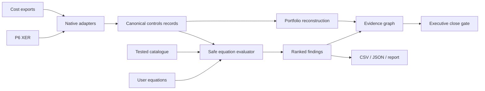

<p align="center">
  
</p>

<p align="center">
  <a href="https://florianstuettgen.github.io/EQ-Proof/"><strong>Open the synthetic Control Room demo</strong></a>
  ·
  <a href="docs/DEMO_PLAYBOOK.md">Five-minute walkthrough</a>
  ·
  <a href="docs/PRODUCT_ARCHITECTURE.md">Product architecture</a>
</p>

<p align="center">
  <a href="https://github.com/FlorianStuettgen/EQ-Proof/actions/workflows/ci.yml"></a>
  <a href="https://github.com/FlorianStuettgen/EQ-Proof/actions/workflows/codeql.yml"></a>
  
  
  
  
</p>

# EQ-Proof Control Room

**Drop in the files behind the monthly close. EQ-Proof reconstructs the reported position, exposes unsupported forecast and baseline movement, and traces every material exception to its source equation.**

Project controls are usually reviewed in fragments: schedule quality in P6, cost and earned value in spreadsheets or enterprise systems, change in a register, risk in another workbook, and the executive forecast in a deck. Each number can look plausible while the combined close is mathematically and procedurally impossible.

EQ-Proof turns those relationships into executable controls.

## What you know in 20 seconds

The checked-in synthetic hyperscale close reconstructs:

| Position | Value | Meaning |
| --- | ---: | --- |
| Reported EAC | **$407M** | what the submitted close claims |
| Defensible EAC | **$418M** | governed `AC + ETC` reconstruction |
| Defensible P80 | **$483M** | defensible EAC plus pending change and quantified risk |
| Hidden exposure | **$76M** | risk-adjusted position above the reported EAC |

The close is blocked because the workbench also finds three blocker-level control failures, including forecast summaries that disagree with their own detail and current-budget movement without an approved bridge.

This is not a hand-authored dashboard fixture. `scripts/regenerate_control_room_demo.py` reproduces the browser payload from the checked-in P6 XER, cost CSV, user equation pack, catalogue, and production analysis code.

## The product

EQ-Proof has two coordinated runtime modes.

### Public synthetic demo

[Open the browser demo](https://florianstuettgen.github.io/EQ-Proof/) to explore:

- an executive close gate;
- reported, defensible, and risk-adjusted positions;
- account-by-account surprise decomposition;
- a navigable source → equation → executive-impact graph;
- a ranked exception command centre;
- the tested equation catalogue;
- the user-equation workbench.

The static demo cannot accept private files.

### Local real-file application

```bash
python -m venv .venv
. .venv/bin/activate                    # Windows: .venv\Scripts\activate
python -m pip install -e '.[web]'
eq-controls serve
```

Open `http://127.0.0.1:8765` if the browser does not open automatically.

The local application accepts:

- one or more Primavera P6 XER exports;
- one or more cost/control-account CSV exports;
- optional JSON equation packs;
- equations authored directly in the browser.

Uploads are processed in an operating-system temporary directory for the request and are not persisted by EQ-Proof. The application has no telemetry, model call, CDN, external script, or database connection.

## The useful workflow

### 1. Supply ordinary project-controls exports

No P6 database connection or bespoke workbook template is required.

The XER adapter reads native `TASK` records. CSV ingestion recognizes common field variants used in P6, EcoSys, SAP, Oracle, Deltek Cobra, Power BI extracts, and analyst workbooks, including:

```text
BAC / budget_at_completion
AC / actual_cost / actuals
ETC / estimate_to_complete
EAC / forecast_at_completion
PV / BCWS
EV / BCWP
baseline_budget / original_budget
approved_changes
pending_change_exposure
risk_exposure
P80_EAC
```

Field mapping is explicit and deterministic. It is not an AI inference layer.

### 2. Choose tested controls and add your own

The built-in catalogue currently spans:

| Domain | Representative equation |
| --- | --- |
| Cost | `EAC == AC + ETC` |
| Forecast | `VAC == BAC - EAC` |
| Earned value | `CV == EV - AC` and `SV == EV - PV` |
| Performance indices | `CPI == EV / AC` and `SPI == EV / PV` |
| Change governance | `current_budget == baseline_budget + approved_changes` |
| Risk | `P80_EAC == EAC + pending_change_exposure + risk_exposure` |
| P6 status integrity | active activity retains positive remaining duration |
| P6 float review | total float remains inside an operational review range |

Project- and client-specific controls use the same engine:

```json
[
  {
    "id": "portfolio.board_authorization",
    "title": "EAC remains inside delegated authorization",
    "domain": "governance",
    "expression": "EAC <= delegated_authorization",
    "severity": "blocker",
    "description": "Forecasts beyond delegated authority require escalation.",
    "remediation": "Supply approved authority or escalate the forecast.",
    "required_fields": ["EAC", "delegated_authorization"],
    "record_type": "control_account"
  }
]
```

The safe evaluator permits numeric constants, declared fields, arithmetic, one comparison, and a small function allow-list. It rejects imports, attributes, assignment, executable statements, unsupported operators, oversized expressions, and oversized syntax trees.

### 3. Compile a decision-grade close

The browser does more than display failures.

It reconstructs separate states:

```text
reported EAC      = submitted EAC
defensible EAC    = AC + ETC
defensible P80    = defensible EAC + pending change + quantified risk
hidden exposure   = defensible P80 - reported EAC
```

Reported source values are never silently overwritten. The submitted and reconstructed states remain visible side by side.

### 4. Trace the surprise

The evidence graph connects:

```text
source record → violated equation → reconstructed metric → close decision
```

Clicking a node opens the source record, equation, residual, executive metric affected, and prescribed remediation. The graph is declared controls lineage, not an unsupported causal-discovery claim.

### 5. Export the action register

The local application and CLI produce machine- and human-readable outputs suitable for:

- Excel and Power Query;
- Power BI;
- Smartsheet;
- SharePoint and workflow automation;
- CI close gates;
- audit and review packages.

## CLI automation remains first class

```bash
eq-controls analyze \
  --p6-xer examples/hyperscale_close/schedule.xer \
  --cost-csv examples/hyperscale_close/cost.csv \
  --equations examples/hyperscale_close/custom_equations.json \
  --output outputs/hyperscale-close
```

```text
CLOSE_BLOCKED records=6 executed=29 blockers=3 failures=5 output=outputs/hyperscale-close
```

Outputs:

- `analysis.json` — complete results;
- `exceptions.csv` — action register;
- `report.md` — review record.

Exit codes are operational: `0` passes, `3` blocks the close, and `2` indicates an input or execution error.

List the tested catalogue:

```bash
eq-controls catalogue
```

## Architecture



The browser is intentionally build-free: semantic HTML, CSS, and vanilla JavaScript served by the local Python application or GitHub Pages. The same production Python engine powers the CLI and local API; the static public mode uses a deterministically generated synthetic payload.

See [Product Architecture](docs/PRODUCT_ARCHITECTURE.md) for runtime modes, data flow, security, and evidence semantics.

## Lower proof engine

The repository also contains the original numerical proof engine for supported linear-convex repairs:

- safe linear specification compiler;
- Dykstra Euclidean projection;
- fixed-value preservation;
- canonical JSON and SHA-256;
- optional Ed25519 attestation;
- semantic replay that independently recompiles and recomputes claimed repairs.

That engine remains available through `eq-proof`. It is a lower-level correctness and attestation capability; the Control Room is now the primary product experience.

## Security and privacy

The local app defaults to loopback and applies a restrictive Content Security Policy.

Controls include:

- no telemetry or model call;
- no external JavaScript, fonts, analytics, or CDN;
- no database credentials;
- 50 MiB per-file upload limit;
- path-basename normalization;
- request-scoped temporary directories;
- no upload persistence;
- escaped user-authored labels in HTML-rendered inspectors;
- safe AST equation evaluation;
- explicit public-demo versus local-real-file boundary.

EQ-Proof does not establish that a source value is contractually true, approve changes, replace P6 scheduling calculations, or infer missing commercial facts.

## Engineering evidence

The current checkpoint passes locally with:

- **103 tests**;
- **92.9% branch-aware coverage** against a 92% gate;
- P6 XER and CSV adapter tests;
- safe and malicious user-equation tests;
- real multipart upload tests;
- deterministic `$76M` portfolio-reconstruction test;
- browser runtime and interaction validation;
- static JavaScript syntax validation;
- deterministic demo regeneration;
- the original adversarial proof, signature, semantic-replay, schema, and solver suite.

Run the repository proof:

```bash
python scripts/check_repository.py
```

## Repository map

```text
src/eq_proof/
├── controls.py             equation catalogue, safe evaluation, P6 and CSV adapters
├── control_room.py         portfolio reconstruction and evidence graph
├── webapp.py               local FastAPI boundary and security headers
├── web/                    static/local browser application
├── proof.py                proof construction and semantic replay
├── solver.py               supported numerical repair engine
└── ...

examples/hyperscale_close/  executable P6 + cost + equation fixture
docs/DEMO_PLAYBOOK.md       five-minute panel and manager walkthrough
docs/PRODUCT_ARCHITECTURE.md runtime, data flow, security and product boundary
tests/                      engine, controls, API, web and adversarial tests
```

## Status

EQ-Proof is a **Beta portfolio and engineering product**, not a production cost system, schedule engine, key-management service, or contractual certification platform.

The current product boundary is intentionally real and demonstrable: P6 `TASK` ingestion, tabular cost/control-account ingestion, tested and user-supplied equations, portfolio reconstruction, evidence lineage, browser review, exports, CLI gates, and deterministic synthetic evidence.

The next domain expansions are P6 relationships, calendars and constraints; cross-period change reconstruction; WBS/control-account rollups; and dedicated adapter profiles for additional enterprise exports.

## License

Apache-2.0 © 2026 Florian Stuettgen.
