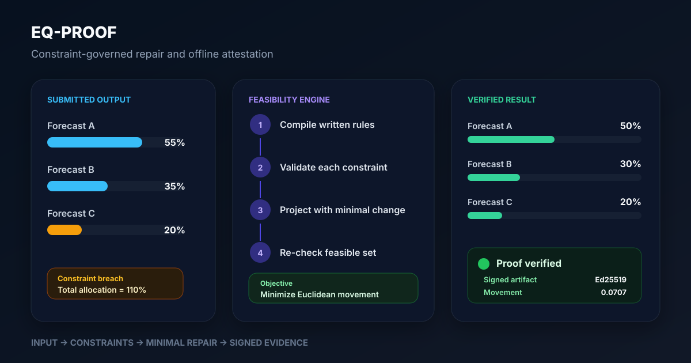
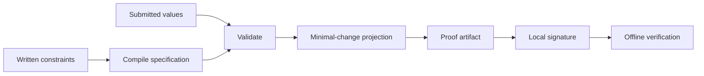

# EQ-PROOF

**Repair invalid numerical outputs against declared constraints, minimize the permitted change, and produce an artifact that can be verified offline.**



*Worked example: the submitted allocation totals 110%. `Forecast C` is fixed at 20%, so the nearest feasible repair moves `Forecast A` to 50% and `Forecast B` to 30%.*

## The operating problem

Forecasts, allocations, scoring models, and generated numeric outputs can violate rules even when their source process completes successfully.

EQ-PROOF makes those rules explicit, validates the submitted output, projects invalid values onto the supported feasible set, and records the repair in a signed proof artifact.

## What one run establishes

| Question | Evidence produced |
| --- | --- |
| Was the submitted output feasible? | Constraint-by-constraint validation |
| What changed? | Original and repaired values |
| How much changed? | Numerical movement from the submitted output |
| Which rules governed the result? | Preserved constraint specification |
| Can the artifact be checked later? | Offline signature verification |

## Worked example

Submitted values:

```text
Forecast A = 0.55
Forecast B = 0.35
Forecast C = 0.20
```

Rules:

```text
0 <= Forecast A <= 1
0 <= Forecast B <= 1
0 <= Forecast C <= 1
Forecast A + Forecast B + Forecast C = 1
fixed(Forecast C)
```

The submitted total is `1.10`. Because `Forecast C` is fixed at `0.20`, the minimum-change repair distributes the required reduction across the two movable values:

```text
Forecast A = 0.50
Forecast B = 0.30
Forecast C = 0.20
```

The complete executable walkthrough is in [`notebooks/EQ_Proof.ipynb`](notebooks/EQ_Proof.ipynb).

## Workflow



## Supported constraint types

| Type | Purpose |
| --- | --- |
| `bounds` | Lower and upper limits |
| `linear_eq` | Linear equality relationships |
| `linear_leq` | Linear inequality relationships |
| `equality` | Symbolic equality fallback |
| `sum_leq` | Combined-value caps |
| `simplex` | Nonnegative values summing to one |
| `monotone` | Nondecreasing sequences |
| `fixed` | Values excluded from projection |

## Install

Python 3.9 or newer is required.

```bash
python -m venv .venv
```

Windows:

```powershell
.venv\Scripts\python.exe -m pip install -e .[dev]
```

macOS or Linux:

```bash
. .venv/bin/activate
python -m pip install -e '.[dev]'
```

## Run

Notebook:

```text
notebooks/EQ_Proof.ipynb
```

CLI:

```bash
eq-proof examples/spec_budget_cap.json examples/inputs_budget_bad.json \
  --out outputs/proof_budget.json \
  --md outputs/proof_budget.md

eq-proof-verify outputs/proof_budget.json
```

## Attestation boundary

If `keys/ed25519_sk.hex` exists and PyNaCl is installed, EQ-PROOF uses Ed25519. Otherwise it can use an HMAC-SHA256 fallback through local configuration.

The HMAC fallback supports local demonstration. It is not equivalent to managed production key infrastructure. Real keys are ignored by Git and must never be committed.

## Verify the repository

```bash
pytest
python -m compileall -q eq_proof cli.py verify_cli.py
```

## What this is not

- It does not prove that the declared business rules are correct.
- It does not validate source data or the upstream model.
- It does not establish that the nearest feasible output is the best business decision.
- It is not a production key-management service.

## Status

**Version:** `0.1.0`  
**Maturity:** working prototype  
**Primary boundary:** offline numerical repair and attestation

Next evidence priorities are versioned proof compatibility, malformed-proof tests, reproducible performance benchmarks, and a tagged release.

## License

Apache-2.0.