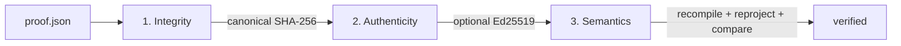
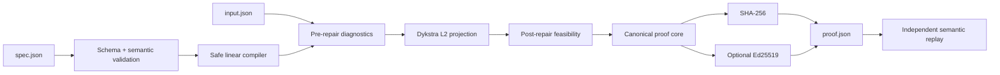

<p align="center">
  
</p>

<p align="center">
  <a href="https://github.com/FlorianStuettgen/EQ-Proof/actions/workflows/ci.yml"></a>
  <a href="https://github.com/FlorianStuettgen/EQ-Proof/actions/workflows/codeql.yml"></a>
  
  
  
  
</p>

# EQ-Proof

**Turn numeric rules into an executable contract: diagnose invalid outputs, compute the nearest feasible repair, attest the artifact, and independently replay the result offline.**

EQ-Proof addresses a narrow but consequential failure mode in analytics and automated decision systems: a process can complete successfully while its numeric output still volates the rules that make the output usable.

A forecast can total 110%. A budget can exceed its approved cap. A generated allocation can move a value that was already authorized and fixed. Ordinary validation tells you that the output is wrong; EQ-Proof records **why**, repairs it with a declared objective, and produces evidence that a separate verifier can recompute.

## What is different here

| Capability | Validator | Optimizer | Signed log | EQ-Proof |
| --- | :---: | :---: | :---: | :---: |
| Identifies violated numeric rules | ✓ | sometimes | — | ✓ |
| Computes a feasible replacement | — | ✓ | — | ✓ |
| Defines “minimal change” explicitly | — | sometimes | — | **L2 projection** |
| Preserves fixed submitted values | — | model-specific | — | ✓ |
| Records the specification and input | — | — | ✓ | ✓ |
| Detects artifact mutation | — | — | ✓ | ✓ |
| Verifies signer possession | — | — | ✓ | optional Ed25519 |
| Recomputes the claimed repair | — | — | — | **semantic replay** |

The last row is the core differentiator. A valid signature proves that a payload was signed; it does not prove that the payload's numeric claims are correct. EQ-Proof verification re-parses the embedded specification, re-runs the repair, and compares the claimed result, movement, objective, residuals, and diagnostics.

## The proof, not the promise

The checked-in example submits:

```text
forecast_a = 0.55
forecast_b = 0.35
forecast_c = 0.20  # fixed approved reserve
sum          1.10  # invalid
```

The governing equation is:

```text
forecast_a + forecast_b + forecast_c == 1
```

Because `forecast_c` is fixed, the Euclidean projection moves only the two free values:

```text
forecast_a = 0.50
forecast_b = 0.30
forecast_c = 0.20
sum          1.00
movement_L2  0.0707106781
objective    0.0025          # 1/2 × movement_L2²
```

This is executable evidence, not a hand-authored screenshot:

- [`examples/portfolio_allocation/`](examples/portfolio_allocation/) contains the submitted values and specification.
- [`evidence/portfolio-allocation.proof.json`](evidence/portfolio-allocation.proof.json) is the authoritative signed artifact.
- [`evidence/portfolio-allocation.report.md`](evidence/portfolio-allocation.report.md) is a human-readable derivative.
- [`scripts/regenerate_evidence.py`](scripts/regenerate_evidence.py) reproduces both byte-for-byte and verifies them through semantic replay.

## Verification has three independent layers



1. **Integrity** — remove the attestation, canonicalize the remaining JSON, and recompute its SHA-256 digest.
2. **Authenticity** — when signed, verify the Ed25519 signature and optionally require an independently trusted public key.
3. **Semantic replay** — parse the embedded rules and submission, rerun the supported projection algorithm, and compare every material claim.

Digest-only proofs still receive integrity and semantic verification, but make no identity claim. `--integrity-only` is available for fast inspection and is deliberately reported as `semantics=skipped`.

## Architecture



The package is intentionally layered:

```text
src/eq_proof/
├── compiler.py       safe AST-to-linear-form compiler
├── specification.py document and semantic validation
├── diagnostics.py   constraint residuals and violation evidence
├── solver.py        Dykstra projection and repair orchestration
├── proof.py         proof construction, semantic replay, reporting
├── attestation.py   Ed25519 keys, signatures, and fingerprints
├── api.py           high-level embedding API
├── cli.py           validate, repair, verify, keygen
├── domain.py        immutable domain models
├── canonical.py     deterministic JSON and SHA-256
└── errors.py        explicit failure taxonomy
```

See [Architecture](docs/ARCHITECTURE.md) for invariants, algorithm choice, complexity, and failure semantics.

## Quickstart

Python 3.10 or newer is required.

```bash
python -m venv .venv
. .venv/bin/activate                 # Windows: .venv\Scripts\activate
python -m pip install -e '.[dev]'
```

### 1. Diagnose without changing anything

```bash
eq-proof validate \
  --spec examples/portfolio_allocation/spec.json \
  --input examples/portfolio_allocation/input.json
```

Expected result and exit code:

```text
VIOLATION max_violation=1.000e-01 failed_constraints=1
- allocation-total: violation=0.1 rule=forecast_a + forecast_b + forecast_c == 1
```

`validate` exits `3` when rules are violated, allowing a pipeline to distinguish constraint failure from execution failure.

### 2. Generate a signing key

```bash
eq-proof keygen \
  --private-key keys/private.pem \
  --public-key keys/public.pem
```

Private keys are written atomically with mode `0600` on POSIX systems and are ignored by Git.

### 3. Repair and attest

```bash
eq-proof repair \
  --spec examples/portfolio_allocation/spec.json \
  --input examples/portfolio_allocation/input.json \
  --proof outputs/portfolio.proof.json \
  --report outputs/portfolio.report.md \
  --private-key keys/private.pem
```

```text
REPAIRED movement_l2=0.0707106781187 max_violation_after=0.000e+00 proof=outputs/portfolio.proof.json
```

### 4. Verify against a trusted public key

```bash
eq-proof verify outputs/portfolio.proof.json \
  --public-key keys/public.pem
```

```text
VERIFIED integrity=pass signature=pass semantics=pass fingerprint=<sha256>
```

## Python API

```python
import json
from pathlib import Path

from eq_proof import prove_document, verify_document

spec = json.loads(Path("examples/portfolio_allocation/spec.json").read_text())
values = json.loads(Path("examples/portfolio_allocation/input.json").read_text())

proof = prove_document(spec, values)
verification = verify_document(proof)

assert verification.fully_verified
assert proof["result"]["values"] == {
    "forecast_a": 0.50,
    "forecast_b": 0.30,
    "forecast_c": 0.20,
}
```

The lower-level API also exposes immutable specifications, diagnostics, repair results, proof construction, and explicit exception types.

## Specification language

```json
{
  "schema_version": "1.0",
  "name": "portfolio-allocation",
  "variables": {
    "forecast_a": {"lower": 0, "upper": 1},
    "forecast_b": {"lower": 0, "upper": 1},
    "forecast_c": {"lower": 0, "upper": 1, "fixed": true}
  },
  "equations": [
    {
      "id": "allocation-total",
      "expression": "forecast_a + forecast_b + forecast_c == 1"
    }
  ]
}
```

Supported syntax is deliberately narrow: declared variables, finite constants, parentheses, `+`, `-`, scalar multiplication/division, and one `==`, `<=`, or `>=` relation. The compiler rejects calls, attributes, imports, powers, nonlinear products, chained comparisons, undeclared names, Python keywords, and oversized syntax trees.

| Rule | Example | Convex set |
| --- | --- | --- |
| Bounds | `0 <= x <= 1` | box |
| Fixed submitted value | `"fixed": true` | coordinate equality |
| Linear equality | `a + b == 1` | hyperplane |
| Linear inequality | `civil + mechanical <= 1000000` | half-space |
| Ordering | `electrical <= mechanical` | half-space |

The published schemas are in [`schemas/`](schemas/). See [Specification Language](docs/SPECIFICATION.md) for grammar, validation rules, and examples.

## Guarantees and exact boundary

For the supported linear-convex model, EQ-Proof establishes that:

- the submitted vector and declared specification are preserved in the artifact;
- each reported pre- and post-repair diagnostic can be recomputed;
- fixed values remain exactly equal to their submitted values;
- the repaired vector satisfies the encoded constraints within the declared tolerance;
- the repaired vector matches EQ-Proof's Euclidean projection replay;
- the artifact digest is correct;
- an Ed25519 signature is valid for the embedded key, and optionally for a separately trusted key.

It does **not** establish that the business rules are correct, the source data is truthful, Euclidean distance is the right business objective, a key belongs to a claimed organization without an external trust channel, or unsupported nonlinear/discrete constraints have been solved.

The engine fails closed when it cannot establish feasibility within tolerance and the iteration budget.

## Engineering evidence

The `1.1.0` checkpoint passes:

- **87 tests** with **96.26% branch-aware coverage**;
- adversarial compiler tests for nonlinear and executable syntax;
- false-but-rehashed and false-but-validly-signed proof tests;
- independent semantic replay of results and diagnostics;
- JSON Schema validation for all examples and generated proofs;
- deterministic evidence regeneration;
- test, coverage, compilation, and wheel checks on Python 3.10–3.13, plus deterministic signed CLI replay on Python 3.13 in CI.

Run the same repository proof locally:

```bash
python scripts/check_repository.py
```

A reproducible microbenchmark and its environment-stamped baseline are in [`benchmarks/`](benchmarks/). The numbers are presented as local engineering evidence, not a throughput SLA.

## Documentation and wiki

| Resource | Purpose |
| --- | --- |
| [Architecture](docs/ARCHITECTURE.md) | Components, invariants, algorithm, complexity, data flow |
| [Specification](docs/SPECIFICATION.md) | JSON contract and expression grammar |
| [Proof format](docs/PROOF_FORMAT.md) | Artifact fields, canonicalization, signatures |
| [Verification](docs/VERIFICATION.md) | Integrity, authenticity, semantic replay |
| [Threat model](docs/THREAT_MODEL.md) | Assets, attackers, controls, exclusions |
| [Development](docs/DEVELOPMENT.md) | Setup, tests, release and evidence workflow |
| [Architecture decisions](docs/adr/) | Why Dykstra, canonical JSON, and replay |
| [Wiki home](wiki/Home.md) | Task-oriented project guide and navigation |

The `wiki/` directory is the version-controlled source of truth for the GitHub Wiki. See [`wiki/README.md`](wiki/README.md) for publication instructions.

## Repository map

```text
examples/      executable domain examples
schemas/       published specification and proof schemas
evidence/      deterministic signed artifact and report
benchmarks/    reproducible local performance baseline
docs/          design, security, format, and ADR documentation
wiki/          version-controlled wiki source pages
scripts/       repository proof, evidence, and benchmark tooling
src/           production package
tests/         compiler, solver, proof, CLI, API, and schema tests
```

## Status

EQ-Proof is a **Beta engineering portfolio project**, not a production key-management or regulated optimization service. The implementation and evidence are complete for the declared 1.x boundary; future work is versioned proof migration, weighted norms, sparse constraint representations, and externally audited interoperability fixtures.

## License

Apache-2.0 © 2026 Florian Stuettgen.
