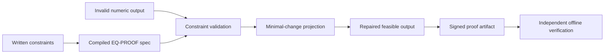
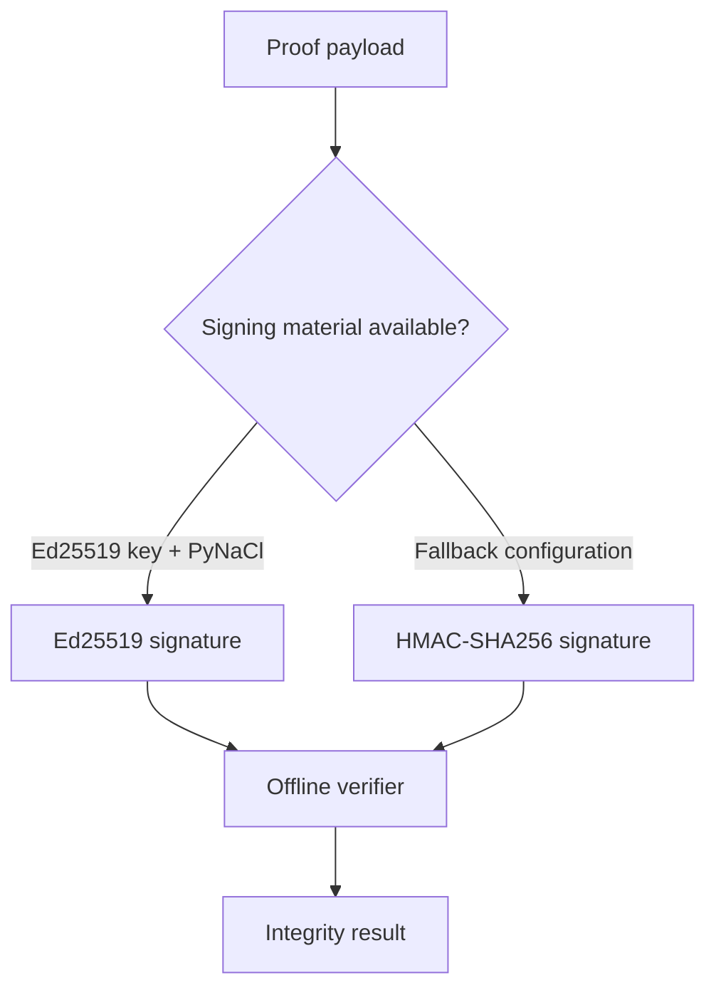
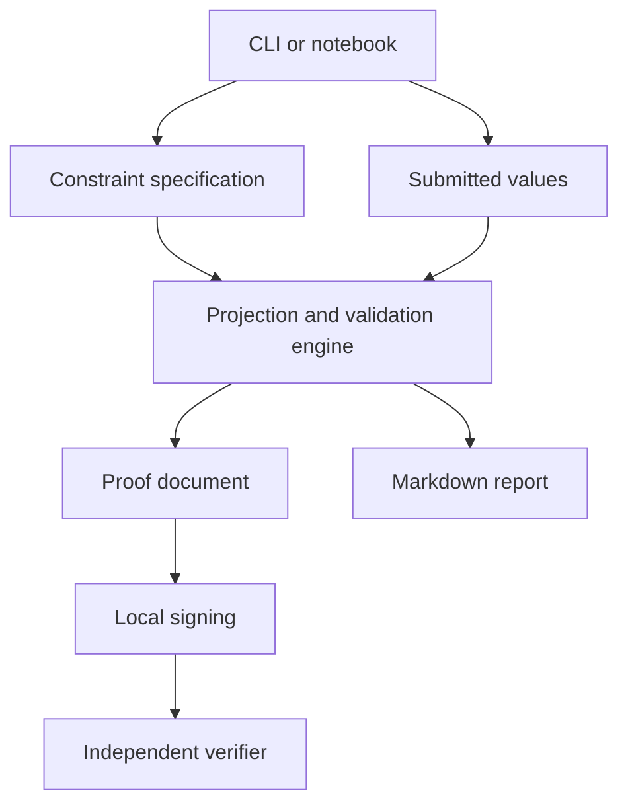

# EQ-PROOF

**Repair invalid numerical outputs against declared constraints, minimize the change, and produce a proof artifact that can be verified offline.**

A forecast allocation totals 103%. One category exceeds its approved cap. Several values are fixed and must not move. EQ-PROOF turns those written rules into machine-checkable constraints, projects the invalid output onto the feasible set, and records exactly what changed.



## What You Know After One Run

| Question | EQ-PROOF output |
| --- | --- |
| Was the original output feasible? | Constraint-by-constraint validation result |
| What changed? | Original and repaired values |
| How much changed? | Minimal Euclidean movement from the submitted output |
| Which rules governed the repair? | Versioned constraint specification |
| Can the result be checked later? | Signed JSON proof plus an offline verifier |

## Example Decision Path

Input:

```text
p1 = 0.55
p2 = 0.35
p3 = 0.20
```

Rules:

```text
0 <= p1 <= 1
0 <= p2 <= 1
0 <= p3 <= 1
p1 + p2 + p3 = 1
```

The submitted vector sums to `1.10`. EQ-PROOF projects it onto the feasible set using the smallest supported numerical change, then emits the repaired values and the evidence required to verify the result.

The complete runnable walkthrough is in [`notebooks/EQ_Proof.ipynb`](notebooks/EQ_Proof.ipynb).

## Core Workflow

1. Write constraints such as `0 <= p1 <= 1`, `p1 + p2 + p3 = 1`, or `fixed(cap)`.
2. Compile those constraints into an EQ-PROOF specification.
3. Validate a submitted numerical output.
4. Project infeasible values onto the feasible set with minimal Euclidean change.
5. Write a machine-readable proof and a human-readable report.
6. Verify the proof without a network connection.

## What This Is

- An offline constraint-validation and numerical-repair workflow.
- A transparent projection process over declared feasible rules.
- A way to preserve the submitted values, repaired values, governing specification, and attestation result together.
- A foundation for controlled analytical outputs in forecasting, allocation, scoring, and model post-processing.

## What This Is Not

- A guarantee that the declared business rules are correct.
- A substitute for model validation, source-data controls, or professional judgment.
- A proof that the repaired output is uniquely desirable; it is the nearest supported feasible output under the configured objective.
- A production key-management system.

## Constraint Types

| Type | Purpose |
| --- | --- |
| `bounds` | Lower and upper limits on a variable |
| `linear_eq` | Linear equality relationships |
| `linear_leq` | Linear inequality relationships |
| `equality` | SymPy fallback for symbolic or nonlinear equality expressions |
| `sum_leq` | Cap the combined value of selected variables |
| `simplex` | Require nonnegative values that sum to one |
| `monotone` | Require values to be nondecreasing |
| `fixed` | Preserve selected variables during projection |

## Install

Python 3.9 or newer is required.

```bash
python -m venv .venv
```

Windows:

```powershell
.venv\Scripts\python.exe -m pip install -e .[dev]
```

macOS or Linux:

```bash
. .venv/bin/activate
python -m pip install -e '.[dev]'
```

## Run the Notebook

Open [`notebooks/EQ_Proof.ipynb`](notebooks/EQ_Proof.ipynb) in Jupyter, VS Code, or another notebook environment and run it from top to bottom.

The notebook:

- creates an example written specification;
- repairs an infeasible output vector;
- signs the result;
- verifies the signature; and
- writes proof artifacts under `outputs/`.

## Run the CLI

```powershell
.venv\Scripts\python.exe cli.py examples\spec_budget_cap.json examples\inputs_budget_bad.json --out outputs\proof_budget.json --md outputs\proof_budget.md
.venv\Scripts\python.exe verify_cli.py outputs\proof_budget.json
```

Installed command entry points are also available:

```bash
eq-proof examples/spec_budget_cap.json examples/inputs_budget_bad.json --out outputs/proof_budget.json --md outputs/proof_budget.md
eq-proof-verify outputs/proof_budget.json
```

## Attestation Boundary



If `keys/ed25519_sk.hex` exists and PyNaCl is installed, EQ-PROOF uses Ed25519. Otherwise it uses an HMAC-SHA256 fallback through `EQPROOF_KEY`, `keys/attest_key.txt`, or the demo key.

The HMAC fallback is useful for local demonstrations but is not equivalent to managed production signing infrastructure. Real keys are ignored by Git and must never be committed.

## Verify the Repository

```bash
pytest
python -m compileall -q eq_proof cli.py verify_cli.py
```

## Architecture



The package is intentionally local and dependency-light. Constraint handling and projection live under `eq_proof/`; `cli.py` creates proof artifacts, while `verify_cli.py` checks them independently.

## Current Status

**Version:** `0.1.0`  
**Maturity:** working prototype  
**Primary boundary:** offline numerical repair and attestation

Next evidence priorities:

- publish reproducible performance measurements by variable and constraint count;
- add a versioned proof-schema compatibility policy;
- document adversarial and malformed-proof cases;
- create a formal tagged release; and
- expand end-to-end examples for project forecasting and allocation controls.

## License

Apache-2.0.