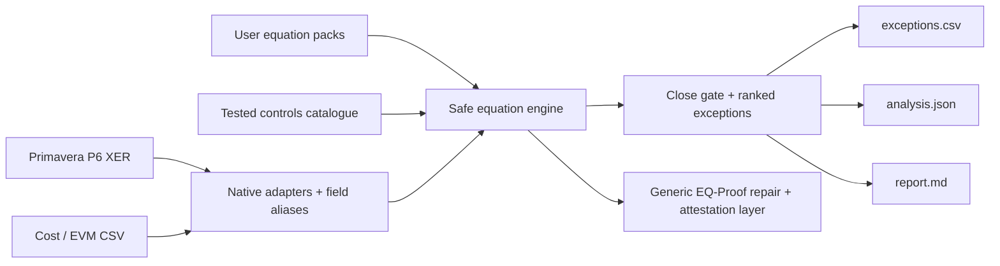

<p align="center">
  
</p>

<p align="center">
  <a href="https://github.com/FlorianStuettgen/EQ-Proof/actions/workflows/ci.yml"></a>
  <a href="https://github.com/FlorianStuettgen/EQ-Proof/actions/workflows/codeql.yml"></a>
  
  
  
  
</p>

# EQ-Proof

**A project-controls equation workbench that turns P6 and cost-system exports into an executable, repeatable close gate.**

Project controls teams routinely trust dashboards built from numbers that are individually plausible but mutually impossible:

- EAC does not equal actual cost plus ETC;
- VAC disagrees with BAC and EAC;
- CPI and SPI were calculated from different periods;
- current budget cannot be bridged to baseline plus approved change;
- P80 omits pending change or quantified risk;
- a P6 activity is marked in progress with zero remaining duration;
- negative float is buried inside thousands of activities.

Most organizations detect these conditions through copied spreadsheet formulas, visual inspection and tribal knowledge. EQ-Proof makes those checks **portable, testable and executable**.

## The useful part

```bash
eq-controls analyze \
  --p6-xer examples/hyperscale_close/schedule.xer \
  --cost-csv examples/hyperscale_close/cost.csv \
  --output outputs/hyperscale-close
```

```text
CLOSE_BLOCKED records=6 executed=29 blockers=3 failures=5 output=outputs/hyperscale-close
```

The checked-in example finds:

| Severity | Source record | Finding | Why it matters |
| --- | --- | --- | --- |
| blocker | `MEP-200` | EAC is $7M below `AC + ETC` | the published forecast is internally impossible |
| blocker | `MEP-200` | current budget is $5M above baseline plus approved change | budget movement has no approved bridge |
| blocker | `CIV-100` | EAC is $4M below `AC + ETC` | forecast detail and summary disagree |
| major | `CIV-A100` | active P6 activity has zero remaining duration | progress status and schedule logic conflict |
| minor | `CIV-A100` | total float is below the review threshold | contractual or logic damage may be hidden |

The output directory contains:

- `analysis.json` — complete machine-readable results;
- `exceptions.csv` — a flat action register ready for Excel, Power Query, Power BI, Smartsheet or workflow automation;
- `report.md` — a close decision record for reviewers.

Exit codes are designed for automation: `0` passes the close gate, `3` blocks the close, and `2` indicates an execution or input error.

## Equations: catalogue plus your rules

The built-in, tested catalogue covers cost, earned value, change, risk and schedule assurance:

```text
EAC == AC + ETC
VAC == BAC - EAC
CV == EV - AC
SV == EV - PV
CPI == EV / AC
SPI == EV / PV
current_budget == baseline_budget + approved_changes
P80_EAC == EAC + pending_change_exposure + risk_exposure
remaining_duration_hours > 0
```

List it directly:

```bash
eq-controls catalogue
```

Add project- or client-specific equations without modifying Python:

```json
[
  {
    "id": "portfolio.board_authorization",
    "title": "EAC remains inside delegated authorization",
    "domain": "governance",
    "expression": "EAC <= delegated_authorization",
    "severity": "blocker",
    "description": "Forecasts beyond delegated authority require escalation.",
    "remediation": "Supply approved authority or escalate the forecast.",
    "required_fields": ["EAC", "delegated_authorization"]
  }
]
```

```bash
eq-controls analyze \
  --cost-csv monthly-close.csv \
  --equations client-rules.json \
  --output outputs/monthly-close
```

The safe evaluator supports numeric fields, constants, parentheses, arithmetic, comparisons, and the allow-listed functions `abs`, `min`, `max` and `round`. Imports, attributes and arbitrary Python execution are rejected.

## Native project-controls inputs

### Primavera P6

The XER adapter reads the `TASK` table directly and maps activity ID, WBS, status, original duration, remaining duration, total float and physical progress into canonical fields. It requires no database connection, P6 API credential or intermediate workbook.

### Cost systems and spreadsheets

CSV ingestion automatically recognizes common export names including:

- `BAC` / `budget_at_completion`;
- `AC` / `actual_cost`;
- `ETC` / `estimate_to_complete`;
- `EAC` / `forecast_at_completion`;
- `PV` / `BCWS`;
- `EV` / `BCWP`;
- baseline, approved-change, pending-change and risk fields.

Only equations whose required fields are present are executed. A partial export still produces useful results instead of forcing the user to populate a giant template.

## Why this is different from another dashboard

A dashboard visualizes the state it receives. EQ-Proof decides whether that state is internally admissible before it reaches the dashboard.

| Typical workflow | EQ-Proof |
| --- | --- |
| formulas copied between monthly workbooks | versioned equation catalogue and reusable user packs |
| checks tied to one report layout | field aliases and canonical controls vocabulary |
| P6 exported to Excel before QA begins | direct XER parsing |
| exceptions discovered by visual inspection | deterministic ranked exception register |
| no machine-readable close decision | operational exit codes and JSON output |
| calculations difficult to reproduce | equations, inputs and residuals preserved in output |

## Two-layer architecture



The project-controls workbench is the operational product. The original EQ-Proof engine remains underneath for constrained minimal-change repair, canonical proof artifacts, SHA-256 integrity, Ed25519 attestation and semantic replay.

## Install

```bash
python -m venv .venv
. .venv/bin/activate                 # Windows: .venv\Scripts\activate
python -m pip install -e '.[dev]'
```

Available commands:

```text
eq-controls catalogue
eq-controls analyze ...
eq-proof validate ...
eq-proof repair ...
eq-proof verify ...
eq-proof keygen ...
```

## Python API

```python
from eq_proof.controls import CATALOGUE, analyze, load_csv, parse_xer, write_outputs

records = [
    *parse_xer("schedule.xer"),
    *load_csv("cost-close.csv"),
]
result = analyze(records, equations=CATALOGUE)
write_outputs(result, "outputs/close")

if not result.close_ready:
    for blocker in result.blockers:
        print(blocker.record_id, blocker.equation_id, blocker.remediation)
```

## Engineering evidence

The new controls layer was validated locally with focused tests covering:

- safe user equation execution and malicious-call rejection;
- CSV alias mapping;
- P6 XER parsing;
- catalogue selection by available fields;
- user equation packs;
- blocker ranking and close-gate exit codes;
- JSON, CSV and Markdown output generation.

The existing repository gate continues to enforce branch coverage, module compilation, deterministic evidence regeneration, wheel construction, signed CLI replay and CodeQL. See [`tests/test_controls.py`](tests/test_controls.py) and [`docs/PROJECT_CONTROLS.md`](docs/PROJECT_CONTROLS.md).

## Documentation

| Resource | Purpose |
| --- | --- |
| [Project controls workbench](docs/PROJECT_CONTROLS.md) | inputs, catalogue, equation packs, outputs and operating boundary |
| [Architecture](docs/ARCHITECTURE.md) | proof-engine components and invariants |
| [Specification](docs/SPECIFICATION.md) | generic repair specification language |
| [Proof format](docs/PROOF_FORMAT.md) | canonical proof and attestation fields |
| [Verification](docs/VERIFICATION.md) | integrity, authenticity and semantic replay |
| [Threat model](docs/THREAT_MODEL.md) | security controls and exclusions |
| [Wiki](wiki/Home.md) | task-oriented project navigation |

## Honest boundary

EQ-Proof can establish that supplied values violate supplied equations and can make the execution repeatable. It cannot establish that the source systems are truthful, that a client-specific equation is good governance, or that a flagged issue has contractual significance without professional review.

The project is Beta. Its current native integration boundary is P6 XER plus tabular cost/control exports; it does not claim live P6 database or Oracle API integration.

## License

Apache-2.0 © 2026 Florian Stuettgen.
