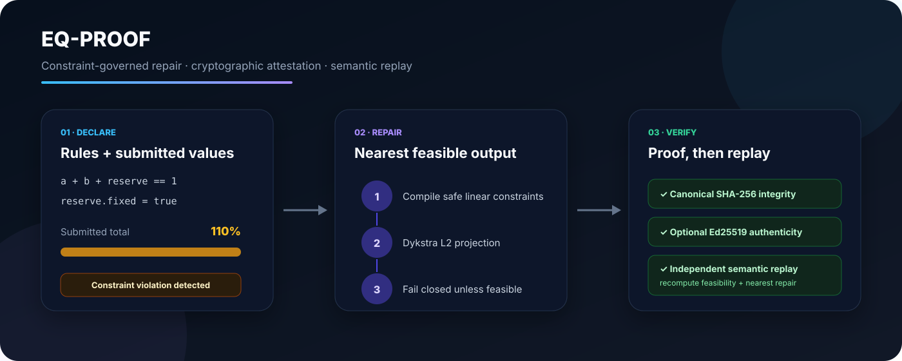

<p align="center">
  
</p>

<p align="center">
  <a href="https://github.com/FlorianStuettgen/EQ-Proof/actions/workflows/ci.yml"></a>
  
  
  
  
</p>

# EQ-Proof

**Compile declared linear equations into constraints, diagnose invalid numeric outputs, project them to the nearest feasible point, and emit a proof artifact that can be verified offline.**

EQ-Proof is for the uncomfortable gap between “the system produced a number” and “the number obeys the rules.” It preserves the submitted values, the governing specification, every detected violation, the repaired result, the measured movement, and the cryptographic verification material in one authoritative JSON artifact.

## The proof, not the promise

The checked-in example starts here:

```text
forecast_a = 0.55
forecast_b = 0.35
forecast_c = 0.20  # fixed
sum          1.10  # invalid
```

The specification requires `forecast_a + forecast_b + forecast_c == 1`. Because `forecast_c` is fixed, the Euclidean projection moves only the other two values:

```text
forecast_a = 0.50
forecast_b = 0.30
forecast_c = 0.20
sum          1.00
movement_L2  0.0707106781
```

This result is not hand-authored documentation. It is regenerated by [`scripts/regenerate_evidence.py`](scripts/regenerate_evidence.py), preserved in [`evidence/portfolio-allocation.proof.json`](evidence/portfolio-allocation.proof.json), and verified in the test suite and CI.

## What one run establishes

| Question | Evidence in `proof.json` |
| --- | --- |
| What rules governed the output? | Full versioned specification plus SHA-256 digest |
| Was the submission feasible? | Constraint-by-constraint pre-repair diagnostics |
| What changed? | Submitted and repaired values with per-value deltas in the report |
| Was change minimized? | Dykstra Euclidean projection and measured L2 movement |
| Is the result feasible? | Post-repair residuals checked against tolerance |
| Was the artifact altered? | Canonical payload SHA-256 |
| Was it signed by the expected key? | Ed25519 signature plus optional trusted public-key match |

## Install

```bash
python -m venv .venv
. .venv/bin/activate              # Windows: .venv\Scripts\activate
python -m pip install -e '.[dev]'
```

## Run the signed workflow

```bash
# 1. Generate a local Ed25519 keypair
eq-proof keygen \
  --private-key keys/private.pem \
  --public-key keys/public.pem

# 2. Repair and attest
eq-proof repair \
  --spec examples/portfolio_allocation/spec.json \
  --input examples/portfolio_allocation/input.json \
  --proof outputs/portfolio.proof.json \
  --report outputs/portfolio.report.md \
  --private-key keys/private.pem

# 3. Verify against the trusted public key
eq-proof verify outputs/portfolio.proof.json \
  --public-key keys/public.pem
```

Expected command result:

```text
REPAIRED movement_l2=0.0707106781187 max_violation_after=0.000e+00 proof=outputs/portfolio.proof.json
VERIFIED <signer fingerprint>
```

No private key produces a digest-only proof. That mode detects mutation but makes no signer claim.

## Specification language

```json
{
  "schema_version": "1.0",
  "name": "portfolio-allocation",
  "variables": {
    "forecast_a": {"lower": 0, "upper": 1},
    "forecast_b": {"lower": 0, "upper": 1},
    "forecast_c": {"lower": 0, "upper": 1, "fixed": true}
  },
  "equations": [
    {
      "id": "allocation-total",
      "expression": "forecast_a + forecast_b + forecast_c == 1"
    }
  ]
}
```

The compiler supports finite constants, declared variables, parentheses, `+`, `-`, scalar multiplication/division, and one `==`, `<=`, or `>=` relation. It rejects nonlinear terms, function calls, attributes, imports, chained comparisons, and arbitrary Python execution.

## Supported feasible sets

| Rule | Example | Projection set |
| --- | --- | --- |
| Lower and upper bounds | `0 <= x <= 1` | Box |
| Fixed submitted values | `"fixed": true` | Coordinate equality |
| Linear equality | `a + b == 1` | Hyperplane |
| Linear inequality | `civil + mechanical <= 1000000` | Half-space |
| Ordering | `electrical <= mechanical` | Half-space |

Their intersection is convex. EQ-Proof uses Dykstra's algorithm to compute the nearest feasible point in Euclidean distance. If feasibility is not established within tolerance and the iteration budget, the run fails instead of emitting a successful proof.

## Verify the repository

```bash
python scripts/check_repository.py
python scripts/regenerate_evidence.py
git diff --exit-code
```

The 1.0.0 reconstruction checkpoint passed **54 tests with 96.37% measured coverage** locally. CI repeats the test and coverage gate, compiles every module, regenerates evidence byte-for-byte, and exercises a signed CLI round trip on Python 3.10, 3.11, 3.12, and 3.13.

## Documentation

| Document | Purpose |
| --- | --- |
| [Architecture](docs/ARCHITECTURE.md) | Components, algorithm choice, data flow, package boundary |
| [Security boundary](SECURITY.md) | Protected properties, key handling, and exclusions |

## Exact trust boundary

EQ-Proof proves that an encoded result is consistent with an encoded supported specification, records how the submitted values changed, and can attest the artifact with a key. It does **not** prove that the business rules are correct, that the source data is truthful, that minimum Euclidean movement is the best business decision, or that a key belongs to a claimed identity without an independently trusted fingerprint.

## License

Apache-2.0 © 2026 Florian Stuettgen.
