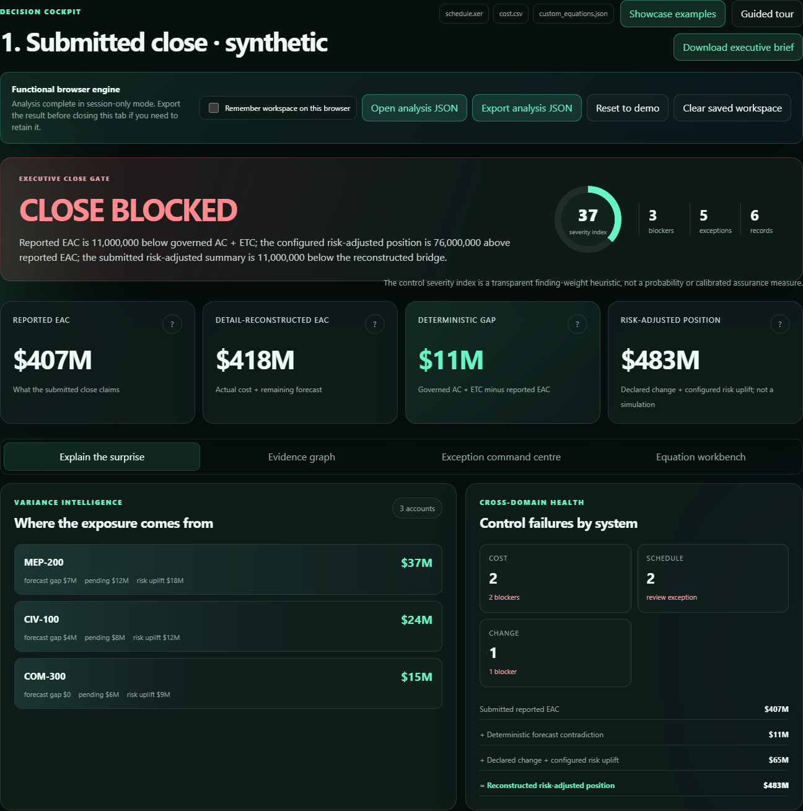

# EQ-Proof Control Room

**Check a project close against the records behind it.**

EQ-Proof checks cost forecasts, change, risk and Primavera P6 exports, then traces each finding to its source record and equation. It is built for project-controls review and reproducible technical inspection.

[**Open the functional browser workbench**](https://florianstuettgen.github.io/EQ-Proof/) · [Worked examples](docs/SHOWCASE.md) · [Five-minute walkthrough](docs/DEMO_PLAYBOOK.md)



## See the decision, then inspect the evidence

Start with the [functional browser workbench](https://florianstuettgen.github.io/EQ-Proof/). No installation or account is required.

- **Take the guided Control Room tour** to follow the submitted forecast, the discrepancy, the source record and the required action.
- Open **Showcase examples**, choose a case, and select **Run example** to compile synthetic source files in your browser and see what produces a blocked, review-required or ready result.
- **Download the executive brief, exceptions CSV or analysis JSON** to inspect the result outside the app. You can export and reopen the complete analysis.

Files are processed entirely in the browser and are never uploaded by the hosted workbench. It is session-only by default; keeping a workspace in browser storage requires explicit opt-in. See [Runtime Modes and Data Handling](docs/RUNTIME_MODES.md).

## Three examples you can reproduce

The [close walkthrough](examples/close_walkthrough/README.md) uses three deliberately constructed input sets for the same synthetic project. These are supplied scenarios, not automatic repairs or a cross-period comparison feature.

| Case | What the inputs demonstrate | Expected gate |
| --- | --- | --- |
| Blocked | A $407M reported forecast conflicts with $418M of actual cost plus remaining forecast; the budget bridge also fails. | **CLOSE BLOCKED** |
| Review | Corrected cost inputs reconcile to $418M; two schedule checks still fail. | **REVIEW REQUIRED** |
| Ready | Corrected cost and schedule inputs satisfy the applicable checks. | **CLOSE READY** |

In the blocked case, the **$11M** forecast contradiction is separate from **$65M** of declared change and configured risk. Together they put the supplied risk-adjusted position **$76M** above reported EAC. The **detail-reconstructed EAC** is arithmetic, not an independent forecast opinion.

Each example includes the input files, an executed authorization rule, source hashes, expected results and generated reports. [Read the worked case and evidence](docs/SHOWCASE.md).

## Run the Python application

Python 3.10–3.13 are covered by CI. From a terminal:

```bash
git clone https://github.com/FlorianStuettgen/EQ-Proof.git
cd EQ-Proof
python -m venv .venv
```

Activate with `source .venv/bin/activate` on macOS/Linux, or `.venv\Scripts\Activate.ps1` in PowerShell. Then:

```bash
python -m pip install -e '.[web]'
eq-controls serve
```

Open `http://127.0.0.1:8765`. The local app uses Python on loopback; selected files are held in temporary storage for the request.

For a reproducible command-line example:

```bash
eq-controls analyze --p6-xer examples/close_walkthrough/blocked/schedule.xer --cost-csv examples/close_walkthrough/blocked/cost.csv --equations examples/close_walkthrough/blocked/custom_equations.json --currency USD --fail-on blocker --output outputs/blocked
```

**Exit code 3 is expected:** this example deliberately fails the close gate. Replace `blocked` with `review` or `ready` to inspect the other inputs. With `--fail-on blocker`, both return 0; use `--fail-on minor` to include the review case's schedule findings in the failure threshold.

Outputs: `analysis.json`, `control-room.json`, `exceptions.csv`, and `report.md`.

## Inspect the engineering

```bash
python -m pip install -e '.[dev]'
python scripts/check_repository.py
npm ci
npm run test:browser-engine
npx playwright install chromium
npm run test:ui
```

Checks cover Python behavior and branch coverage, browser/Python equivalence, deterministic evidence, installed-wheel assets, and browser workflows across desktop, mobile and reduced-motion settings. The exact test count is recorded with each validated change; the Python branch-coverage gate is 92%.

[Architecture](docs/PRODUCT_ARCHITECTURE.md) · [Semantic model](docs/SEMANTIC_MODEL.md) · [Development](docs/DEVELOPMENT.md) · [Security](SECURITY.md)

## Scope

**Beta.** `CLOSE READY` means no selected, applicable control failed. Missing fields can make a control not applicable; readiness does not establish data completeness, authorization or management approval.

Current adapters cover CSV exports and P6 XER `TASK` records. EQ-Proof does not replace a scheduling engine, infer financial impacts from schedule findings, certify source truth, or calculate a probabilistic P80. Cross-period comparison remains separate development work.

The optional [`eq-proof` numerical engine](docs/ARCHITECTURE.md) provides numerical repair, signing and semantic replay; `eq-controls` runs the project-controls workflows shown here.

Apache-2.0 · [License](LICENSE)
