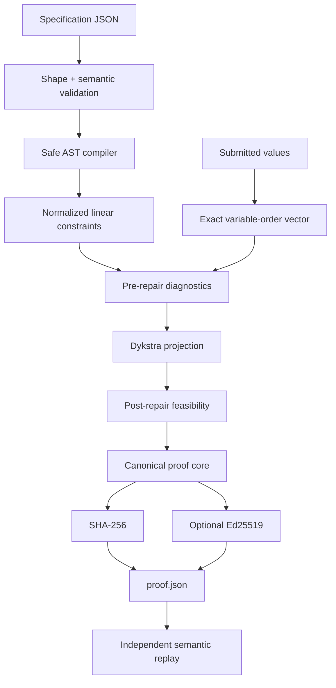

# Architecture

## System boundary

EQ-Proof accepts a local JSON specification and a local JSON map of submitted numeric values. It emits an authoritative JSON proof and an optional Markdown report. Runtime network access is neither required nor used.

The system is intentionally not a general-purpose optimizer. Version 1.x supports intersections of boxes, hyperplanes, and half-spaces, including fixed submitted coordinates.

## Architectural invariants

1. **The specification is data, never executable code.** Expressions are parsed with Python's AST but only a small allow-listed linear grammar is compiled.
2. **Fixed means exact.** A fixed variable is removed from free-variable space and cannot drift numerically during projection.
3. **Repair is deterministic for a given supported specification, input, tolerance, and iteration budget.**
4. **No successful proof is emitted without post-repair feasibility.**
5. **The JSON proof is authoritative.** Markdown is a derived convenience view.
6. **Verification is independent.** The verifier recomputes digests, signatures, and the encoded numerical result.
7. **Failure is explicit.** Malformed input, unsupported syntax, infeasibility/non-convergence, key errors, and invalid proofs use separate domain exceptions.

## Components

| Component | Responsibility | Explicit non-responsibility |
| --- | --- | --- |
| `compiler.py` | Convert an allow-listed expression into a normalized coefficient vector | Execute Python or support nonlinear terms |
| `specification.py` | Validate document structure, identifiers, bounds, metadata, and equations | Infer business meaning |
| `diagnostics.py` | Quantify bound and equation residuals | Decide whether a rule is desirable |
| `solver.py` | Compute the Euclidean projection and preserve fixed values | Optimize an unstated business objective |
| `proof.py` | Build canonical artifacts, replay semantics, and render reports | Manage enterprise key infrastructure |
| `attestation.py` | Handle Ed25519 keys, signatures, fingerprints, and payload integrity | Establish real-world signer identity |
| `api.py` | Provide stable embedding functions | Hide lower-level types or failures |
| `cli.py` | Expose validation, repair, verification, and key generation | Become a long-running service |

## Data flow



## Why Dykstra's algorithm

Each supported rule is a closed convex set with a cheap projection:

- bounds → box projection;
- equality → hyperplane projection;
- inequality → half-space projection;
- fixed coordinate → elimination from free-variable space.

Dykstra's algorithm cycles through these projectors with correction terms and converges to the Euclidean projection onto their intersection. Therefore, “minimal change” in version 1.x means:

\[
\operatorname*{argmin}_{x \in C} \frac{1}{2}\lVert x-y \rVert_2^2
\]

where `y` is the submitted vector and `C` is the encoded feasible set.

A plain alternating-projection implementation would generally find a feasible point but not necessarily the nearest one. The correction terms are not an implementation detail; they are what preserve the stated objective.

## Fixed-value handling

Fixed variables are never represented as mutable solver coordinates. Their contribution is moved to each constraint's right-hand side. This has two benefits:

- the fixed value remains bit-for-bit equal to the submitted value;
- constraints rendered impossible by fixed values fail before iteration.

## Convergence and failure semantics

The solver stops when the infinity norm of the iterate change is within the declared tolerance. The result is then independently checked against every bound and equation with a controlled feasibility tolerance. If that check fails, or the iteration budget is exhausted, the engine raises `InfeasibleProblem` and does not emit a successful proof.

Exhaustion does not mathematically distinguish an empty feasible set from severe numerical conditioning; the error message states both possibilities rather than overclaiming an infeasibility certificate.

## Semantic replay

Verification does more than validate the signature. It:

1. validates the proof structure and algorithm identifier;
2. recomputes the canonical payload digest;
3. verifies the optional Ed25519 signature;
4. verifies the specification and submission digests;
5. parses the embedded specification;
6. reruns repair with the encoded tolerance and iteration budget;
7. compares variable names, repaired values, movement, objective, residuals, and diagnostics.

A malicious signer can create a valid signature over a false numerical claim. Semantic replay rejects that artifact.

## Complexity

Let `n` be the number of free variables, `m` the number of projectors, and `k` the number of Dykstra cycles. The dense implementation uses approximately `O(kmn)` arithmetic and `O(mn)` correction storage. Version 1.x prioritizes clarity and independently inspectable logic over sparse large-scale optimization.

The checked-in benchmark covers representative dense cases up to 250 variables. It is a local baseline, not an SLA.

## Package layout

```text
src/eq_proof/
├── api.py
├── canonical.py
├── cli.py
├── compiler.py
├── diagnostics.py
├── domain.py
├── errors.py
├── proof.py
├── attestation.py
├── solver.py
├── specification.py
├── __init__.py
└── __main__.py
```

## Versioning

- `schema_version` versions the specification contract.
- `proof_schema` versions the artifact contract.
- `engine.version` identifies the implementation release.
- `engine.algorithm` identifies the replayed numerical contract.

A future implementation may support older proof schemas while refusing unknown algorithm identifiers. Silent reinterpretation is not permitted.
