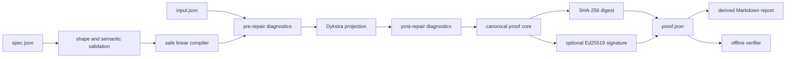

# Architecture

## System boundary

EQ-Proof accepts two local files: a constraint specification and a submitted numeric vector. It emits an authoritative JSON proof and an optional Markdown report. Network access is neither required nor used.

## Components

| Component | Responsibility | Explicit non-responsibility |
| --- | --- | --- |
| Specification loader | Validate document shape, versions, bounds, identifiers, and finite numbers | Infer business meaning |
| Linear compiler | Convert a safe expression subset into coefficient vectors | Execute Python or solve nonlinear expressions |
| Diagnostics | Quantify every bound and equation violation before and after repair | Decide whether a rule is desirable |
| Projection solver | Find the nearest point in the supported convex feasible set | Optimize business utility beyond minimum Euclidean movement |
| Proof builder | Preserve specification, input, result, diagnostics, hashes, and engine metadata | Hide input or constraint contents |
| Attestation verifier | Recompute the payload digest and verify Ed25519 signatures | Establish signer identity without a trusted fingerprint |

## Why Dykstra's algorithm

Each supported rule defines a closed convex set: a box, a hyperplane, or a half-space. Dykstra's algorithm applies simple set projections with correction terms and converges to the Euclidean projection onto their intersection. That is the exact meaning of “minimal change” in EQ-Proof 1.0: minimize the L2 distance from the submitted vector, subject to the declared supported constraints.

The implementation fails closed when convergence does not establish feasibility within the configured iteration budget. It does not silently return a near-feasible answer.

## Data flow



## Package layout

```text
src/eq_proof/
├── core.py       # public compatibility façade
├── model.py      # models, safe compiler, validation, diagnostics
├── solver.py     # Euclidean projection and repair orchestration
├── proof.py      # canonical proof, SHA-256, Ed25519, Markdown report
├── cli.py        # keygen, repair, verify
├── __init__.py   # public API
└── __main__.py   # python -m eq_proof
```
