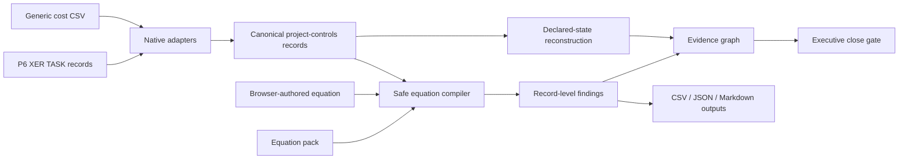

# Product architecture

EQ-Proof is a local-first project-controls assurance product. The **Control Room** is the primary product surface; the adapters, equation engine and numerical proof engine support that surface at different layers.

## Product hierarchy

1. **EQ-Proof Control Room** — the interactive monthly-close review product for reconstructing the declared position, applying controls, tracing exceptions and exporting evidence.
2. **Project-controls engine and adapters** — the Python and browser implementations that normalize Primavera P6 and tabular cost evidence, execute the restricted equation language and build the Control Room payload.
3. **Numerical proof engine** — an independently versioned lower-level capability for bounded numerical repair, canonical proof construction, optional Ed25519 attestation and semantic replay. It is not required to understand the ordinary project-controls close gate.

The package exposes `eq-controls` for project-controls workflows and `eq-proof` for the lower numerical proof workflow. Documentation should introduce the Control Room and `eq-controls` first unless the subject is specifically proof construction or verification.

## Product boundary

The application answers:

- Is the close internally consistent under the declared controls?
- Which equations fail and on which source records?
- What EAC is reconstructed from available `AC + ETC` detail?
- What risk-adjusted position results from declared pending-change and configured-risk fields?
- Does the submitted risk-adjusted summary reconcile to that declared bridge?
- Which findings affect financial reconstruction, governance assurance, schedule assurance or the close gate?

It does not assert that source data is contractually true, approve change, replace a scheduling engine, infer missing commercial facts, convert currencies or calculate a statistical P80 from deterministic additions.

The authoritative terms and formulas are defined in [Semantic Model](SEMANTIC_MODEL.md). File movement and persistence are controlled by [Runtime Modes and Data Handling](RUNTIME_MODES.md).

## Runtime modes

### Hosted browser workbench

`src/eq_proof/web/` is a build-free static application suitable for GitHub Pages. It loads the deterministic demonstration and can also parse user-selected generic CSV, Primavera P6 XER `TASK` and JSON equation-pack files directly in the browser.

The hosted application has no EQ-Proof upload endpoint. Selected files are read by the browser and are not sent to an EQ-Proof server, analytics service, model endpoint or third-party API.

The workbench is session-only by default. It stores the complete Control Room JSON in browser local storage only after the user explicitly enables **Remember workspace on this browser**. The user can disable persistence or clear the saved workspace without closing the active session.

### Local Control Room

```bash
eq-controls serve
```

starts a FastAPI application on an allow-listed loopback interface and opens the same frontend. The browser sends selected files only to the local process. The local API writes them to a request-scoped operating-system temporary directory, invokes the production Python adapters and equation engine, returns JSON and deletes the temporary directory when the request completes.

### CLI automation

```bash
eq-controls analyze ...
```

runs the Python project-controls engine without the interactive application, emits machine-usable exit codes and writes JSON, CSV and Markdown artifacts to the selected output directory.

The lower `eq-proof` CLI provides numerical repair, proof, signing and verification commands under its separate artifact contracts.

## Data flow



## Main modules

| Module | Responsibility |
| --- | --- |
| `controls.py` | P6 XER `TASK` parsing, generic CSV alias mapping, equation catalogue, safe evaluation, source hashing, findings and CLI outputs |
| `control_room.py` | deterministic and risk-adjusted state reconstruction, severity-index metadata, assurance routing, portfolio summaries and bounded evidence graph |
| `webapp.py` | loopback FastAPI boundary, upload limits, temporary-file lifecycle, validation endpoint, security headers and static serving |
| `web/` | build-free responsive interface, browser-side adapters and equation engine, evidence graph, filtered exception register and deterministic demo |
| `proof.py` | canonical proof construction, attestation and semantic replay for the independently versioned numerical-repair engine |

## Declared-state reconstruction

For each control account with the required fields:

```text
reported EAC                         = submitted EAC
detail-reconstructed EAC             = AC + ETC
deterministic forecast gap           = detail-reconstructed EAC - reported EAC
reconstructed risk-adjusted EAC      = detail-reconstructed EAC + pending change + configured risk uplift
risk-adjusted reconciliation         = reconstructed risk-adjusted EAC - submitted risk-adjusted EAC
exposure above reported EAC          = reconstructed risk-adjusted EAC - reported EAC
```

The current schema retains the machine field `defensible_eac` for compatibility. Visitor-facing copy calls it **detail-reconstructed EAC** because the value proves an arithmetic relationship, not independent commercial defensibility.

The submitted and reconstructed states remain separate. EQ-Proof never silently overwrites the source value.

In the synthetic fixture:

```text
reported EAC                         $407M
deterministic forecast contradiction  $11M
detail-reconstructed EAC             $418M
declared change + risk uplift          $65M
reconstructed risk-adjusted position  $483M
submitted risk-adjusted summary       $472M
risk-adjusted reconciliation gap       $11M
exposure above reported EAC            $76M
```

The `$76M` is a comparison between the declared risk-adjusted bridge and reported deterministic EAC. Only `$11M` is an internal deterministic forecast contradiction. The remaining `$65M` is declared pending-change and configured-risk exposure, not automatically hidden or erroneous.

## Equation execution

Every equation declares:

- stable ID;
- title and domain;
- expression;
- severity;
- description and remediation;
- required fields;
- tolerance;
- compatible record type; and
- optional applicability predicate.

Equations execute only when their required fields exist on a compatible record and any applicability predicate matches. Missing-data conditions are explicit `not_applicable` results rather than silent passes.

The evaluators permit finite numeric constants, declared fields, arithmetic, one comparison and a small function allow-list. They reject imports, attributes, comprehensions, assignment, executable statements, unsupported operators, duplicate IDs, undeclared expression fields, oversized expressions and oversized syntax trees.

## Evidence graph

The graph is a declared review model, not causal discovery. It connects:

- source/control-account or P6 activity nodes;
- failed equation nodes;
- reconstructed financial metrics;
- non-financial assurance domains; and
- the close decision.

Financial findings affect financial reconstructions only where the relationship is encoded. Schedule-quality findings route to schedule assurance and the gate; they do not acquire an invented dollar impact. Graph rendering is capped and reports truncation for large datasets.

## Cross-engine semantic control

The hosted browser and Python implementations are independent. Their ordinary unit suites are supplemented by a shared golden-fixture test that runs the checked-in hyperscale source files through the browser engine and compares the resulting gate, reconstruction, findings, source manifest and evidence graph with `demo-data.json` generated by the Python engine.

CI also regenerates the Python-produced public demonstration and fails on any checked-in evidence drift. Together these controls make semantic disagreement visible rather than relying on similar-looking interfaces.

## Reproducibility

Native adapters attach a SHA-256 digest to each source manifest entry. `analysis.json` embeds:

- source names and hashes;
- record counts and types;
- the complete equation manifest;
- every pass, failure and not-applicable result; and
- JSON-safe residual state.

The CLI additionally emits `control-room.json`, while `exceptions.csv` and `report.md` provide operational derivatives. Reproduction evidence remains relative to the supplied files, equations and engine version; it does not prove that the source records were truthful, authorized or complete before ingestion.

## Security model

The frontend uses no external scripts, fonts, analytics, model calls or CDNs. Hosted analysis executes in the browser. Local mode uses the same frontend with a loopback Python API.

Controls include:

- no hosted upload endpoint;
- session-only hosted operation by default and explicit browser-persistence opt-in;
- loopback-only local host selection and trusted-host enforcement;
- 50 MiB per-file, 200 MiB per-request and 20-file local limits;
- equation-count, expression-size, AST-node and row-count limits;
- path-basename normalization and unique temporary filenames;
- request-scoped operating-system temporary directories;
- no telemetry;
- escaped user-authored labels in HTML-rendered inspectors;
- spreadsheet-formula neutralization in CSV exports; and
- safe expression evaluation without Python `eval`, JavaScript `eval` or `Function`.

See [Security Policy](../SECURITY.md), [Runtime Modes and Data Handling](RUNTIME_MODES.md) and [Threat Model](THREAT_MODEL.md).

## Current integration boundary

The demonstrated adapters currently cover:

- Primavera P6 XER `TASK` records;
- deterministic alias mapping for generic cost and control-account CSV exports; and
- JSON equation packs and browser-authored equations.

Live EcoSys, SAP, Oracle, Cobra, P6 database and other enterprise connectors are not included. P6 relationship, calendar, constraint, open-end and cross-period intelligence remain explicit product expansion areas rather than implied current capabilities.

## Deterministic public evidence

`scripts/regenerate_control_room_demo.py` rebuilds the public demonstration from:

- `examples/hyperscale_close/schedule.xer`;
- `examples/hyperscale_close/cost.csv`; and
- `examples/hyperscale_close/custom_equations.json`.

CI regenerates the payload and fails if it drifts. This keeps the public demo, README claims, parsers, catalogue, semantic model and reconstruction logic tied to executable evidence.
