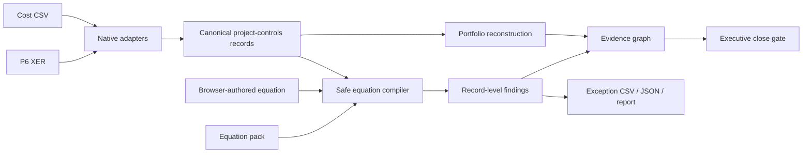

# Product Architecture

EQ-Proof is a local-first project-controls assurance product with three coordinated surfaces:

1. the **Control Room** browser application for interactive review;
2. the **equation workbench and adapters** for P6 and cost exports;
3. the **proof engine and CLI** for deterministic automation and attestation.

## Product boundary

The application answers:

- Is the close internally defensible?
- Which equations fail and on which source records?
- What portfolio position can be reconstructed from governed components?
- How much deterministic, pending-change, and risk exposure is absent from the headline EAC?
- Which source-to-equation routes affect the executive decision?

It does not assert that source data is contractually true, approve change, replace a scheduling engine, or infer missing commercial facts.

## Runtime modes

### Static public demo

`src/eq_proof/web/` is a build-free static application. It loads `demo-data.json`, generated deterministically from the checked-in synthetic fixture.

The static mode is suitable for GitHub Pages and LinkedIn traffic. It contains no real-file analysis endpoint and therefore cannot receive private project data.

### Local real-file mode

```bash
eq-controls serve
```

starts a FastAPI application on `127.0.0.1:8765` and opens the same frontend.

The local API accepts multipart uploads, writes them to an operating-system temporary directory for the duration of the request, invokes the production parsers and equation engine, returns JSON, and deletes the temporary directory when the request completes.

## Data flow



## Main modules

| Module | Responsibility |
| --- | --- |
| `controls.py` | P6 XER parsing, CSV alias mapping, equation catalogue, safe evaluation, findings and CLI outputs |
| `control_room.py` | portfolio reconstruction, surprise decomposition, domain summary and evidence graph |
| `webapp.py` | local FastAPI boundary, upload limits, temporary-file lifecycle, security headers and static serving |
| `web/` | build-free responsive interface, equation editor, evidence graph, exception register and static demo |
| `proof.py` | canonical proof construction, attestation and semantic replay for the lower numerical-repair engine |

## Portfolio reconstruction

For each control account with the required fields:

```text
reported EAC      = submitted EAC
defensible EAC    = AC + ETC
defensible P80    = defensible EAC + pending change exposure + risk exposure
hidden exposure   = defensible P80 - reported EAC
```

The reconstruction does not silently overwrite source data. Reported and reconstructed states remain separate and visible.

In the synthetic fixture:

```text
reported EAC                    $407M
+ forecast contradictions        $11M
+ pending change and risk        $65M
= defensible P80                $483M
hidden above reported EAC        $76M
```

## Equation execution

Every equation declares:

- stable ID;
- title and domain;
- expression;
- severity;
- description and remediation;
- required fields;
- tolerance;
- applicable record type.

Equations are evaluated only when their declared fields exist on a compatible record. Missing-data conditions are explicit `not_applicable` results rather than silent passes.

The AST evaluator permits finite numeric constants, declared fields, arithmetic, one comparison, and a small function allow-list. It rejects imports, attributes, comprehensions, assignment, executable statements, unsupported operators, oversized expressions, and oversized syntax trees.

## Evidence graph

The graph is a derived review model, not a claim of causal discovery. It connects:

- source/control-account or P6 activity nodes;
- failed equation nodes;
- reconstructed executive metric nodes;
- the close decision.

Edges are labelled with declared relationships such as `violates`, `impacts`, `reconstructs`, and `risk_adjusts`. Clicking any node opens the exact supporting evidence.

## Security model

Local mode applies a restrictive Content Security Policy and additional browser hardening headers. The frontend uses no external scripts, fonts, analytics, model calls, or CDNs.

Controls include:

- loopback host by default;
- 50 MiB per-file request limit;
- path-basename normalization;
- operating-system temporary directories;
- no upload persistence;
- no telemetry;
- no external browser connections under the declared CSP;
- escaped user-authored labels in HTML-rendered inspectors;
- safe AST equation evaluation.

See [Threat Model](THREAT_MODEL.md) for the broader engine boundary.

## Deterministic public evidence

`scripts/regenerate_control_room_demo.py` rebuilds the public demo from:

- `examples/hyperscale_close/schedule.xer`;
- `examples/hyperscale_close/cost.csv`;
- `examples/hyperscale_close/custom_equations.json`.

CI runs the generator and fails if the checked-in payload drifts. This keeps the screenshot, README claims, static demo, parsers, catalogue, and reconstruction logic tied to executable evidence.
