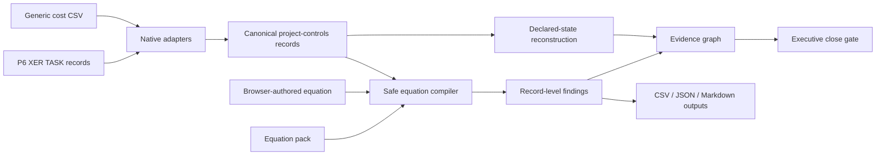

# Product Architecture

EQ-Proof is a local-first project-controls assurance product with three coordinated surfaces:

1. the **Control Room** browser application for interactive review;
2. the **equation workbench and adapters** for P6 and tabular cost exports;
3. the **proof engine and CLI** for deterministic automation and attestation.

## Product boundary

The application answers:

- Is the close internally consistent under the declared controls?
- Which equations fail and on which source records?
- What deterministic EAC can be reconstructed from `AC + ETC`?
- What risk-adjusted position results from the declared pending-change and configured-risk fields?
- Does the submitted risk-adjusted summary reconcile to that declared bridge?
- Which findings affect financial reconstruction, governance assurance, schedule assurance, or the close gate?

It does not assert that source data is contractually true, approve change, replace a scheduling engine, infer missing commercial facts, or calculate a statistical P80 from deterministic additions.

The authoritative terminology and formulas are defined in [Semantic Model](SEMANTIC_MODEL.md).

## Runtime modes

### Static public demo

`src/eq_proof/web/` is a build-free static application. It loads `demo-data.json`, generated deterministically from the checked-in synthetic fixture.

Static mode is suitable for GitHub Pages and LinkedIn traffic. It contains no real-file analysis endpoint and cannot receive private project data.

### Local real-file mode

```bash
eq-controls serve
```

starts a FastAPI application on the loopback interface and opens the same frontend.

The local API accepts multipart uploads, writes them to an operating-system temporary directory for the duration of the request, invokes the production adapters and equation engine, returns JSON, and deletes the temporary directory when the request completes.

## Data flow



## Main modules

| Module | Responsibility |
| --- | --- |
| `controls.py` | P6 XER `TASK` parsing, generic CSV alias mapping, equation catalogue, safe evaluation, source hashing, findings and CLI outputs |
| `control_room.py` | deterministic and risk-adjusted state reconstruction, assurance routing, portfolio summaries and bounded evidence graph |
| `webapp.py` | loopback FastAPI boundary, upload limits, temporary-file lifecycle, validation endpoint, security headers and static serving |
| `web/` | build-free responsive interface, equation editor, evidence graph, filtered exception register and static demo |
| `proof.py` | canonical proof construction, attestation and semantic replay for the independently versioned numerical-repair engine |

## Declared-state reconstruction

For each control account with the required fields:

```text
reported EAC                    = submitted EAC
defensible EAC                  = AC + ETC
deterministic forecast gap      = defensible EAC - reported EAC
reconstructed risk-adjusted EAC = defensible EAC + pending change + configured risk uplift
risk-adjusted reconciliation    = reconstructed risk-adjusted EAC - submitted risk-adjusted EAC
exposure above reported EAC     = reconstructed risk-adjusted EAC - reported EAC
```

The submitted and reconstructed states remain separate. EQ-Proof never silently overwrites the source value.

In the synthetic fixture:

```text
reported EAC                         $407M
deterministic forecast contradiction  $11M
defensible EAC                       $418M
declared change + risk uplift         $65M
reconstructed risk-adjusted position $483M
submitted risk-adjusted summary      $472M
risk-adjusted reconciliation gap      $11M
exposure above reported EAC           $76M
```

The `$76M` is a comparison between the risk-adjusted bridge and reported deterministic EAC. Only `$11M` is an internal deterministic forecast contradiction. The remaining `$65M` is declared pending-change and configured-risk exposure, not automatically “hidden.”

## Equation execution

Every equation declares:

- stable ID;
- title and domain;
- expression;
- severity;
- description and remediation;
- required fields;
- tolerance;
- compatible record type;
- optional applicability predicate.

Equations execute only when their required fields exist on a compatible record and any applicability predicate matches. Missing-data conditions are explicit `not_applicable` results rather than silent passes.

The AST evaluator permits finite numeric constants, declared fields, arithmetic, one comparison, and a small function allow-list. It rejects imports, attributes, comprehensions, assignment, executable statements, unsupported operators, duplicate IDs, undeclared expression fields, oversized expressions, and oversized syntax trees.

## Evidence graph

The graph is a declared review model, not causal discovery. It connects:

- source/control-account or P6 activity nodes;
- failed equation nodes;
- reconstructed financial metrics;
- non-financial assurance domains;
- the close decision.

Financial findings affect financial reconstructions only when the relationship is encoded. Schedule-quality findings route to schedule assurance and the gate; they do not acquire an invented dollar impact. Graph rendering is capped and reports truncation for large datasets.

## Reproducibility

Native file adapters attach a SHA-256 digest to each source manifest entry. `analysis.json` embeds:

- source names and hashes;
- record counts and types;
- the complete equation manifest;
- every pass, failure and not-applicable result;
- JSON-safe residual state.

The CLI additionally emits `control-room.json`, while `exceptions.csv` and `report.md` provide operational derivatives.

## Security model

Local mode applies a restrictive Content Security Policy and additional browser hardening headers. The frontend uses no external scripts, fonts, analytics, model calls, or CDNs.

Controls include:

- loopback-only host selection;
- trusted-host enforcement;
- 50 MiB per-file, 200 MiB per-request and 20-file limits;
- equation-count, expression-size, AST-node and row-count limits;
- path-basename normalization and unique temporary filenames;
- request-scoped operating-system temporary directories;
- no upload persistence or telemetry;
- escaped user-authored labels in HTML-rendered inspectors;
- spreadsheet-formula neutralization in CSV exports;
- safe AST equation evaluation.

See [Threat Model](THREAT_MODEL.md) for the broader engine boundary.

## Deterministic public evidence

`scripts/regenerate_control_room_demo.py` rebuilds the public demo from:

- `examples/hyperscale_close/schedule.xer`;
- `examples/hyperscale_close/cost.csv`;
- `examples/hyperscale_close/custom_equations.json`.

CI regenerates the payload and fails if it drifts. This keeps the public demo, README claims, parsers, catalogue, semantic model and reconstruction logic tied to executable evidence.
