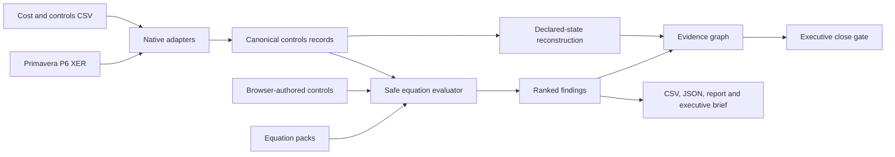

# EQ-Proof Control Room — Portfolio Case Study

## The one-sentence version

EQ-Proof turns ordinary Primavera P6, cost, change and risk exports into an executable monthly-close gate that identifies contradictions, preserves evidence lineage and produces an assignable action register.

## The decision it improves

A project-controls leader does not need another dashboard showing the numbers already in the close package.

They need to know:

1. whether the submitted position is internally defensible;
2. which source record and equation produced each exception;
3. how much of the executive movement is deterministic contradiction versus declared change or risk;
4. what must be corrected before the close is accepted; and
5. whether the same decision can be reproduced later.

EQ-Proof is designed around that decision.

## The synthetic hyperscale scenario

The checked-in demonstration combines:

- a Primavera P6 XER schedule export;
- a control-account cost CSV;
- the tested equation catalogue; and
- a project-specific delegated-authorization rule.

Every individual value is plausible. The combined close is not.

| State | Result | Interpretation |
| --- | ---: | --- |
| Reported EAC | **$407M** | deterministic forecast in the submitted close |
| Defensible EAC | **$418M** | independently reconstructed `AC + ETC` |
| Deterministic forecast gap | **$11M** | submitted EAC is below its own governed detail |
| Declared change and configured risk | **$65M** | pending change plus supplied risk uplift |
| Reconstructed risk-adjusted position | **$483M** | declared bridge built from defensible EAC |
| Submitted risk-adjusted summary | **$472M** | summary supplied by the close |
| Risk-adjusted reconciliation gap | **$11M** | submitted summary is below the declared bridge |
| Position above reported EAC | **$76M** | deterministic contradiction plus declared exposure |

The product deliberately refuses to collapse those values into one sensational number.

The `$11M` deterministic contradiction is mathematically different from the `$65M` of declared change and configured risk. EQ-Proof preserves that distinction in the data model, interface, graph and exported evidence.

## The 90-second demonstration

### 1. Start at the executive gate

The Control Room opens on **CLOSE BLOCKED** with three blocker-level failures.

This status is not manually assigned. It is derived from the selected and applicable equations.

### 2. Isolate the deterministic contradiction

Reported EAC is `$407M`.

The source detail independently reconstructs to:

```text
AC + ETC = $418M
```

The resulting `$11M` difference is a direct internal contradiction. It does not depend on a risk opinion or predictive model.

### 3. Identify the material control account

The account reconstruction shows which control accounts create the movement and separates each contribution into:

- deterministic forecast gap;
- pending-change exposure; and
- configured risk uplift.

The most material account can be opened to inspect the exact components.

### 4. Trace the evidence

The evidence graph follows the declared route:

```text
source record
    → failed equation
        → affected metric or assurance domain
            → close gate
```

The graph does not invent causal relationships. For example, a P6 schedule-quality finding affects schedule assurance rather than receiving a fabricated dollar impact.

### 5. Turn the result into work

The exception command centre ranks findings by severity and materiality and retains:

- source record;
- equation ID and expression;
- residual;
- declared impact domain; and
- required remediation.

The register exports to spreadsheet-safe CSV. The browser can also generate a Markdown executive brief containing the decision, reconstructed states, top actions and source hashes.

## Why the implementation matters

### It works with ordinary project-controls evidence

The current demonstrated integration boundary is intentionally practical:

- native Primavera P6 XER `TASK` parsing;
- deterministic CSV aliases for cost and control-account exports;
- JSON equation packs; and
- browser-authored project controls validated by the same safe evaluator.

No P6 database connection, proprietary workbook template or cloud service is required.

### User-written equations are first-class

A client- or project-specific control can be written as:

```json
{
  "id": "portfolio.board_authorization",
  "title": "EAC remains inside delegated authorization",
  "domain": "governance",
  "expression": "EAC <= delegated_authorization",
  "severity": "blocker",
  "required_fields": ["EAC", "delegated_authorization"],
  "record_type": "control_account"
}
```

The engine validates declared fields, syntax, applicability, tolerance and record type before execution. Imports, attribute access, assignments and executable statements are rejected.

### Reproducibility is part of the output contract

Analysis output retains:

- SHA-256 source manifests;
- the complete executed equation manifest;
- every pass, failure and not-applicable result;
- schema-versioned portfolio reconstruction; and
- bounded evidence-graph metadata.

The lower numerical proof engine separately supports canonical JSON, Ed25519 attestation and semantic replay.

### The product states its limits

EQ-Proof does not claim to:

- establish contractual truth;
- approve change;
- replace Primavera P6 schedule calculations;
- convert currencies;
- infer missing commercial facts; or
- calculate probabilistic P80 risk.

A source field named `P80_EAC` is accepted as a compatibility alias for a submitted risk-adjusted summary. The product can validate its declared arithmetic bridge; it does not certify the probability methodology behind it.

## Engineering proof

The repository proof currently enforces:

- **124 automated tests**;
- Python **3.10, 3.11, 3.12 and 3.13**;
- branch-aware coverage above a **92% gate**;
- deterministic regeneration of Control Room and signed-proof evidence;
- JavaScript syntax validation;
- wheel construction;
- valid and adversarial equation tests;
- multipart upload and loopback-host security tests;
- P6 XER and CSV adapter tests;
- spreadsheet-formula neutralization; and
- an operational P6 + cost + user-equation close scenario.

The public demo contains no analytics, external scripts, model calls or upload endpoint. Real files are processed only by the loopback local application.

## Architecture at a glance



## What makes the project distinctive

The strongest part of EQ-Proof is not any single equation or interface element.

It is the combination of:

- field-level project-controls practicality;
- explicit mathematical semantics;
- user-authored governance logic;
- evidence lineage;
- honest uncertainty boundaries;
- deterministic automation; and
- a local-first security model.

The result behaves less like a dashboard and more like a compiler for the acceptance logic behind a monthly close.

## Run it

Public synthetic showcase:

```text
https://florianstuettgen.github.io/EQ-Proof/
```

Local real-file application:

```bash
python -m venv .venv
. .venv/bin/activate
python -m pip install -e '.[web]'
eq-controls serve
```

CLI scenario:

```bash
eq-controls analyze \
  --p6-xer examples/hyperscale_close/schedule.xer \
  --cost-csv examples/hyperscale_close/cost.csv \
  --equations examples/hyperscale_close/custom_equations.json \
  --currency USD \
  --output outputs/hyperscale-close
```

## Current boundary and next expansion

The current product is a credible, working project-controls assurance layer—not a full enterprise controls platform.

The highest-value next capabilities are:

1. cross-period snapshot comparison and restatement detection;
2. Primavera relationships, calendars, constraints and open-end analysis;
3. WBS and control-account aggregation scopes;
4. forecast movement bridges with explicit causal drivers; and
5. dedicated adapter profiles for additional enterprise exports.
